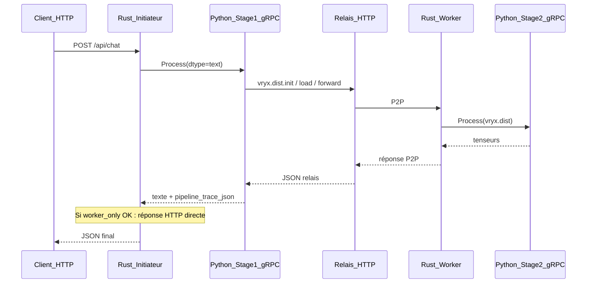

# Rapport Vryx — Worker-only P2P, admin, TP, tests et VPS

**Dernière mise à jour :** 5 mai 2026  
**Dépôt :** Vryx (`Roullioo/Vryx`)

---

## En bref (lecture 60 secondes)

1. **Worker-only** : avec `VRYX_WORKER_ONLY_LLM=1`, le texte du chat peut être produit **sans Ollama** sur le VPS ; les calculs passent par les workers via le relais `vryx.dist.*`.
2. **Tensor parallelism (row-split)** : `tensor_parallel_orchestrator` — activé par défaut sauf `VRYX_TP_ENABLED=0` ; trace `row_split_tensor_parallel` ; plafond de workers via `VRYX_TP_MAX_WORKERS` (latence P2P).
3. **Fan-out distribué** : `distributed_llm_orchestrator` — envoi à N workers, premier retour gagnant ; layout `distributed_fanout` (concurrence, pas collaboration mathématique).
4. **Hybride courant** : Ollama sur le VPS pour la réponse utilisateur **rapide** ; TP peut tourner **en parallèle** pour la trace — d’où parfois des métriques agrégées « worker calcul : 0 ms » alors que le détail est dans `pipeline_trace.steps`.
5. **Admin web** : shell noir, pages workers / sessions / graphes CSS, persistance des sessions en `localStorage`, endpoint interne **`/api/internal/live-peers`** pour la découverte des peers.
6. **Rust** : timeout chat plus long, reset auto de l’état bloqué, court-circuit si la trace Python a déjà traité TP ou fan-out ; **`pipeline_trace_json`** dans le proto.
7. **Mac — 3 workers locaux** : `nodeAndWorker/start-3-workers-mac.sh` et `stop-3-workers-mac.sh` (voir § synthèse).

---

## Comment lire ce document

- Les blocs **[Peu utile / bruit]** signalent du contexte historique, des chemins VPS peut-être périmés, ou des détails qui n’aident pas au diagnostic quotidien — vous pouvez les sauter.
- La **§ Synthèse cumulative** décrit l’ensemble des évolutions recensées (conversation produit + déploiements). En cas de divergence avec le code, **le code fait foi**.

---

## Table des matières

1. [Synthèse cumulative des évolutions (vue projet)](#1-synthèse-cumulative-des-évolutions-vue-projet)
2. [Ce que vous devez retenir sur le JSON de réponse](#2-ce-que-vous-devez-retenir-sur-le-json-de-réponse)
3. [Schéma du flux](#3-schéma-du-flux)
4. [Fichiers modifiés (périmètre worker-only initial)](#4-fichiers-modifiés-périmètre-worker-only-initial)
5. [Comment reproduire les tests en local](#5-comment-reproduire-les-tests-en-local)
6. [Déploiement sur le VPS](#6-déploiement-sur-le-vps)
7. [Limites du MVP](#7-limites-du-mvp)
8. [Références](#8-références)

---

## 1. Synthèse cumulative des évolutions (vue projet)

### 1.1 Serveur Express (`website/server`)

- Mode SSE typé selon la trace pipeline (ex. worker-only P2P).
- **`POST/GET /api/internal/live-peers`** (localhost + en-tête interne) : découverte des PeerId workers actifs pour Python.

### 1.2 Interface admin (React / Vite)

- **`AdminShell`** : refonte (sidebar sombre, icônes, responsive).
- **`AdminNodePage`** : rapport de calcul sous la bulle de réponse, persistance session (`buildSession` / `saveSession`), métriques de round.
- **`WorkerComputeReport`** : barres CSS, types `WorkerRoundMetrics`, repli si pas de trace riche.
- **Sessions** : liste + détail avec diagramme de flux, agrégation des peers (`workerSteps`), encarts explicatifs selon le mode (TP vs fan-out).
- **Workers** : liste et fiche détail.
- **Routes** : `/admin/workers`, `/admin/workers/:peerId`, `/admin/sessions`, `/admin/sessions/:sessionId`.
- **`lib/sessions.ts`** : modèle `WorkSession`, `localStorage`.

**[Peu utile / bruit]** : si l’admin affiche encore d’anciennes étiquettes après déploiement, un **rechargement forcé** du navigateur (cache) peut être nécessaire — ce n’est pas un bug métier persistant.

### 1.3 Inférence Python

- **`inference_server.py`** : Ollama via `/api/chat` + prompt système ; stage 1 avec priorités worker-only / TP en arrière-plan / Ollama pour le texte principal ; `pipeline_trace_json` enrichi.
- **`distributed_llm_orchestrator.py`** : fan-out N workers, découverte relais + API interne live-peers.
- **`tensor_parallel_orchestrator.py`** : TP par défaut, timeouts relay, liste `peers` dans la trace, limite de workers pour éviter les timeouts WAN.

### 1.4 Daemon Rust

- Timeouts chat Axum augmentés ; reset auto si blocage prolongé sur la génération.
- Court-circuit du « warmup » P2P redondant lorsque la trace indique déjà `row_split_tensor_parallel` ou `distributed_fanout`.
- **`vryx.proto`** : champ **`pipeline_trace_json`** aligné avec Python et le binaire compilé.

### 1.5 Déploiement et exploitation

- Frontend servi depuis la **racine Nginx** prévue (`/var/www/vryx/`), pas seulement un dossier home arbitraire.
- Rebuild du daemon sur le VPS après changement de proto.
- Scripts de déploiement : **ne pas** committer de mots de passe ; préférer variables d’environnement / CI secrets.

**[Peu utile / bruit]** : chemins exacts du type `~/vryx-nodeAndWorker-sync/` sur une machine donnée — à adapter à votre serveur actuel ; garder seulement l’idée « sync + `cargo build --release` + binaire à jour ».

### 1.6 macOS — trois workers locaux

- **`nodeAndWorker/start-3-workers-mac.sh`** : 3× Python stage 2 + 3× Rust worker (ports gRPC 50052–50054, API 3031–3033, P2P 4021–4023), clés dans **`.vryx-keys-mac/`** (non versionnées).
- **`nodeAndWorker/stop-3-workers-mac.sh`** : arrêt propre.
- **`VRYX_MAC_DUMMY_DELEGATE=1`** : secret factice pour monter les processus **sans** secret VPS — la **délégation LLM réelle** ne fonctionnera pas ; pour la prod, exporter **`VRYX_INFERENCE_DELEGATE_SECRET`**.

**[Peu utile / bruit]** : multiplier les scripts de démarrage ad hoc sans les documenter — préférer ce rapport + les deux scripts ci-dessus.

### 1.7 Comportements à ne pas confondre

| Sujet | Note |
|--------|------|
| TP vs fan-out | TP = **collaboration** (bandes de matrice) ; fan-out = **course** entre workers. |
| « Un seul worker » dans l’UI | Souvent cache navigateur **ou** trace incomplète **ou** lecture du diagramme sans les `steps` — vérifier `pipeline_trace` brut. |
| Métriques 0 ms côté worker | Compatible avec réponse **Ollama** principale + TP/trace en parallèle. |

---

## 2. Ce que vous devez retenir sur le JSON de réponse

Quand tout va bien après un `POST /api/chat` en mode worker-only :

| Champ | Signification simple |
|--------|----------------------|
| `ok: true` | La requête HTTP s’est terminée correctement. |
| `p2p_messages_out: 0` | Le Rust **n’a pas** renvoyé une deuxième vague « hidden_states » vers le worker (court-circuit worker-only). |
| `pipeline_trace.layout` | Doit être `worker_only_pipeline`. |
| `pipeline_trace.ok` | Doit être `true` si l’orchestrateur Python a réussi. |
| `pipeline_trace.peers` | Liste des `PeerId` qui ont reçu les shards. |
| `pipeline_trace.generation_steps` | Un objet par token généré (toy) : `byte`, `hop_ms`, etc. |
| `response` | Chaîne renvoyée au client ; avec le MVP toy, le contenu est souvent **peu lisible** (octets interprétés en UTF-8). |

**Exemple minimal à viser :**

```json
{
  "ok": true,
  "p2p_messages_out": 0,
  "completion_tokens": 8,
  "pipeline_trace": {
    "layout": "worker_only_pipeline",
    "ok": true,
    "metrics": {
      "prompt_tokens": 73,
      "completion_tokens": 8,
      "total_tokens": 81,
      "vps_delegate_ms": 46
    }
  }
}
```

---

## 3. Schéma du flux



---

## 4. Fichiers modifiés (périmètre worker-only initial)

| Fichier | Rôle |
|---------|------|
| [`nodeAndWorker/python-inference/inference_server.py`](nodeAndWorker/python-inference/inference_server.py) | Trace JSON enrichie (`ok`, `metrics`) pour le court-circuit Rust. |
| [`nodeAndWorker/rust-daemon/src/main.rs`](nodeAndWorker/rust-daemon/src/main.rs) | Fin de chat sans envoi `hidden_states` si worker-only réussi. |
| [`nodeAndWorker/python-inference/distributed_llm_orchestrator.py`](nodeAndWorker/python-inference/distributed_llm_orchestrator.py) | Orchestration relais + fan-out / découverte peers. |
| [`nodeAndWorker/python-inference/shard_runtime.py`](nodeAndWorker/python-inference/shard_runtime.py) | Forward `vryx.dist`. |
| [`nodeAndWorker/test_worker_only_llm.sh`](nodeAndWorker/test_worker_only_llm.sh) | Test E2E local. |

**[Peu utile / bruit]** : considérer cette table comme le **noyau historique** worker-only ; la synthèse §1 liste le périmètre élargi actuel (admin, TP, scripts Mac, etc.).

---

## 5. Comment reproduire les tests en local

```bash
cd nodeAndWorker
./test_worker_only_llm.sh "Votre phrase de test."
```

- Les journaux du dernier run : fichier `/tmp/vryx_worker_only_last_logdir.txt` (contient le chemin vers un répertoire temporaire).

**Autres vérifications utiles :**

```bash
cd nodeAndWorker/rust-daemon && cargo test && cargo build --release
cd ../../website && npm run build
```

**Trois workers sur Mac (réseau + gRPC) :**

```bash
export VRYX_INFERENCE_DELEGATE_SECRET='...'   # secret VPS, ≥ 16 caractères
cd nodeAndWorker && ./start-3-workers-mac.sh
# ou test sans secret réel :
# VRYX_MAC_DUMMY_DELEGATE=1 ./start-3-workers-mac.sh
```

**[Peu utile / bruit]** : anciennes instructions avec `cd ../website` depuis `rust-daemon` — le front est à la racine : **`../../website`** depuis `nodeAndWorker/rust-daemon`.

---

## 6. Déploiement sur le VPS

### 6.1 Ce qui a été fait automatiquement (historique)

1. **Synchronisation** du dossier local `nodeAndWorker/` vers le VPS :  
   `~/vryx-nodeAndWorker-sync/`  
   (sans `target/`, sans `venv/`.)

2. **Compilation** sur le VPS :

   ```bash
   source ~/.cargo/env
   cd ~/vryx-nodeAndWorker-sync/rust-daemon
   cargo build --release
   ```

   Résultat attendu : **succès** (éventuels avertissements libp2p sans impact sur l’exécutable).

3. **Binaire** :  
   `~/vryx-nodeAndWorker-sync/rust-daemon/target/release/rust-daemon`

**[Peu utile / bruit]** : reproduire **à l’identique** ces chemins sur une nouvelle machine ; gardez plutôt une checklist : sync → proto à jour → `cargo build --release` → redémarrage du service → front déployé vers la **racine web** servie par Nginx.

### 6.2 Exploitation (à faire vous-même)

- Configurer **systemd**, **PM2** ou un `tmux` pour lancer ce binaire en **mode initiateur** ou **worker** avec les bons ports (`--api-port`, `--grpc-port`, `--bootstrap-node` si besoin).
- Sur le même hôte que le relais HTTP : lancer `inference_server.py` **stage 1** avec  
  `VRYX_WORKER_ONLY_LLM=1`,  
  `VRYX_P2P_RELAY_URL=http://127.0.0.1:<port_API_initiateur>`,  
  et `VRYX_TP_PEER_IDS` ou découverte via `/api/tp-peers` ou **`/api/internal/live-peers`** selon votre configuration.
- **Python** : créer un venv sur le VPS, `pip install -r python-inference/requirements.txt`, puis lancer les stages nécessaires pour vos tests bout en bout.

---

## 7. Limites du MVP

- Qualité texte **non** comparable à un vrai LLM lorsque le pipeline repose sur le réseau toy (logits réduits par pas).
- Calculs workers en **numpy CPU** par défaut ; GPU optionnel via PyTorch (voir commentaire dans `requirements.txt`).
- Le champ `primary_worker_peer_id` côté HTTP peut ne pas coïncider exactement avec la liste `pipeline_trace.peers` (détail UX à harmoniser plus tard).

**[Peu utile / bruit]** : répéter ces limites dans chaque ticket ou README — renvoyer à cette section suffit.

---

## 8. Références

- Tests historiques Vryx : [`RAPPORT_TESTS_VRYX.md`](RAPPORT_TESTS_VRYX.md)  
- Vision produit : [`VRYX.md`](VRYX.md)
