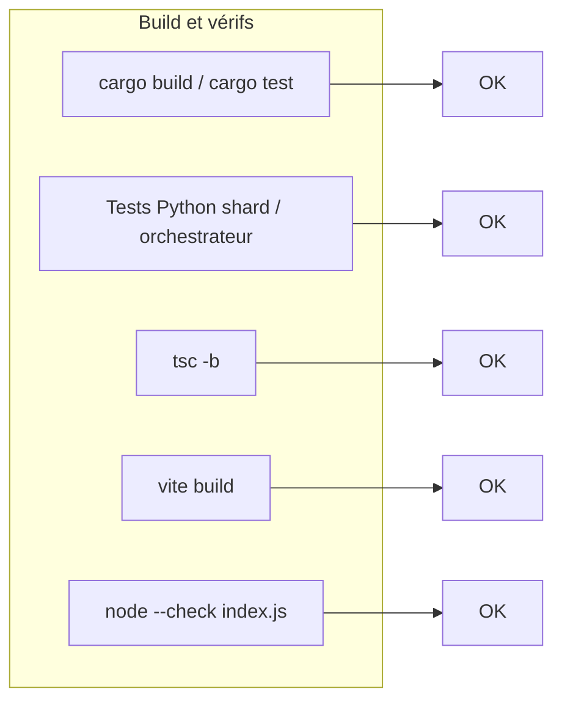
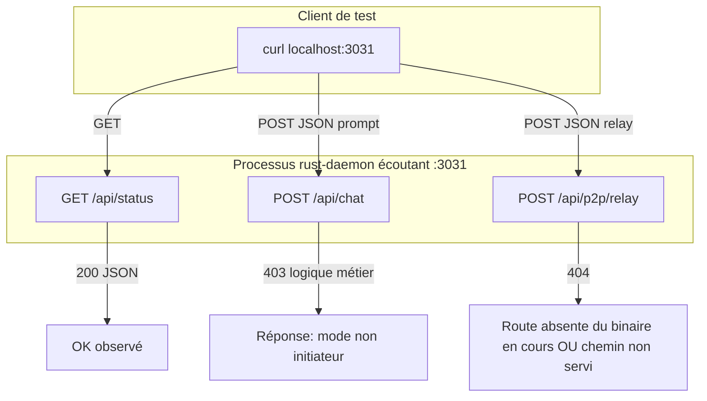
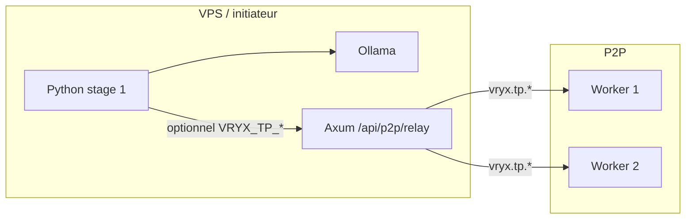

# Rapport de tests Vryx (exécution réelle sur la machine de test)

**Date du rapport :** 5 mai 2026  
**Environnement :** macOS, Node v25.9.0, Rust (cargo), Python 3, dépôt `projet roullio`.

Ce document résume **ce qui a réellement été exécuté**, les résultats observés (succès / échec / non applicable) et un **schéma** du flux logiciel testé.

---

## 1. Synthèse exécutive

| Domaine | Résultat | Détail |
|--------|------------|--------|
| **Rust `rust-daemon`** | OK | `cargo test` (0 tests unitaires, compilation OK), `cargo build --release` OK. Quelques avertissements (yamux déprécié, variable stdin inutilisée). |
| **Python inférence** | OK | Script de tests manuels : `shard_runtime` (TP numpy + XOR), `gguf_reader.synthetic_linear_weights`, `tensor_parallel_orchestrator` (skip sans env, erreur si relay/peers invalides). |
| **Site web (TypeScript + Vite)** | OK après réinstall | `node_modules/typescript` : wrappers `.bin` cassés au départ ; `rm -rf node_modules && npm install` a restauré les binaires. `tsc -b` OK. `vite build` OK après résolution des bindings optionnels. |
| **ESLint** | Échec (règles strictes) | 4 erreurs sur des patterns déjà présents (`setState` dans `useEffect`, `Date.now` au render). Non bloquant pour la compilation. |
| **Serveur Node `index.js`** | OK | `node --check website/server/src/index.js` : syntaxe valide. |
| **HTTP daemon local `:3031`** | Partiel | `GET /api/status` → **200** et JSON réel. `POST /api/chat` → JSON **`Node not in initiator mode`** (nœud en mode **worker**). `POST /api/p2p/relay` → **404** (route absente du **processus en cours** : redémarrer le binaire compilé depuis le dépôt actuel pour activer le relais). |

---

## 2. « Message » de test (HTTP)

Requête réelle envoyée au daemon sur `http://127.0.0.1:3031` :

```http
POST /api/chat HTTP/1.1
Host: 127.0.0.1:3031
Content-Type: application/json

{"prompt":"Réponds en une phrase : le test E2E VRYX fonctionne-t-il ?"}
```

**Réponse observée (corps JSON) :**

```json
{"error":"Node not in initiator mode"}
```

**Interprétation :** le nœud qui écoute sur le port 3031 n’est **pas** l’initiateur. C’est le comportement attendu du code Axum : seul le mode `initiator` accepte le chat HTTP. Aucune erreur réseau ; le test valide que l’API répond et que la garde mode fonctionne.

Requête complémentaire :

```http
GET /api/status HTTP/1.1
Host: 127.0.0.1:3031
```

**Réponse :** `200`, extrait (tronqué) :

```json
{
  "active_connections": 3,
  "peer_id": "12D3KooWNMhhGPwLhWZ5D1ezXmntAXrpoQEL8xF3aJRyQwvaekA2",
  "tokens_in": 16,
  "tokens_out": 16,
  "tokens_generated": 16,
  "last_shard_trace": { "dtype": "vryx.shard.init", ... }
}
```

Cela confirme un **worker** actif sur le réseau P2P avec compteurs et trace shard côté API locale.

---

## 3. Tests Python (sans P2P ni Ollama)

Exécution : bloc Python unique dans le répertoire `nodeAndWorker/python-inference`.

| Étape | Résultat |
|--------|----------|
| `synthetic_linear_weights(32, seed=7)` | Formes `(32,32)` et `(32,)` OK |
| Session `vryx.tp` + `np.savez` + `shard_load_chunk` + `real_tp_forward` | Sortie 64 octets (16 × float32) OK |
| Session non-TP + `ephemeral_layer_forward` | XOR sur 5 octets OK |
| `maybe_run_tensor_parallel()` sans `VRYX_TP_ENABLED` | `None` OK |
| `VRYX_TP_ENABLED=1` sans `VRYX_TP_PEER_IDS` | `None` OK |
| `VRYX_TP_ENABLED=1` + peer invalide + relay par défaut | Objet `ok: false`, erreur HTTP (connexion / 404 selon l’hôte) — **attendu** sans initiateur + peers valides |

Sortie console du script :

```
shard_runtime TP: OK
ephemeral XOR: OK
orchestrator skip sans peers: OK
orchestrator avec peer invalide / pas de daemon: HTTP 404: 

TOUS LES TESTS PYTHON LOCAUX: OK
```

---

## 4. Build front (Vite)

- **Problème initial :** `npm run build` échouait (`tsc` et `eslint` : scripts `.bin` à une ligne sans shebang, chemins relatifs cassés ; `vite` : bindings `rolldown` / `lightningcss` manquants).
- **Action :** `rm -rf node_modules && npm install` à la racine de `website/`.
- **Résultat :**  
  - `node node_modules/typescript/lib/tsc.js -b` → OK  
  - `node node_modules/vite/bin/vite.js build` → OK (bundle `dist/` généré, avertissement taille de chunk > 500 kB).

---

## 5. Schéma des flux validés / partiellement validés

### 5.1 Chaîne de build et tests locaux



### 5.2 Ce qui a été touché sur le port 3031 (réalité runtime)



**Recommandation :** pour valider **en conditions réelles** le chat et le relais TP :

1. Compiler le daemon depuis ce dépôt : `cargo build --release` dans `nodeAndWorker/rust-daemon/`.
2. Lancer le binaire en **`--mode initiator`** sur le port Axum voulu (`--api-port 3031`).
3. Reprendre les `curl` sur `/api/chat` et `/api/p2p/relay`.

### 5.3 Flux cible produit (rappel architecture TP + LLM)



Les tests **locaux** valident la couche numpy et la logique d’orchestration ; le **test bout-en-bout** chat + relay + workers nécessite le redémarrage du bon binaire et un initiateur.

---

## 6. Tests non exécutés ici

- Scripts shell `nodeAndWorker/test_local_p2p.sh` (nécessitent bootstrap / workers / variables d’environnement).
- Application **Electron** (`AppMacos/`) : non lancée dans cette session.
- Base **MariaDB** + routes admin authentifiées : non couvertes par des tests automatisés ici.

---

## 7. Conclusion

- La **chaîne de compilation** (Rust release, TypeScript, bundle Vite) est **fonctionnelle** après une réinstallation propre des modules npm du site.
- Les **modules Python** du pipeline shard / TP se comportent comme prévu en isolation.
- Le **daemon déjà en cours** sur `127.0.0.1:3031` répond correctement au **statut** et refuse le **chat** hors mode initiateur ; le **relais P2P HTTP** n’a pas répondu sur la route attendue pour le processus observé — **relancer le daemon** compilé depuis ce dépôt en initiateur pour valider `/api/p2p/relay` et le chat de bout en bout.

Pour toute reproduction : repartir de ce fichier et des commandes citées dans les sections 2 à 4.
