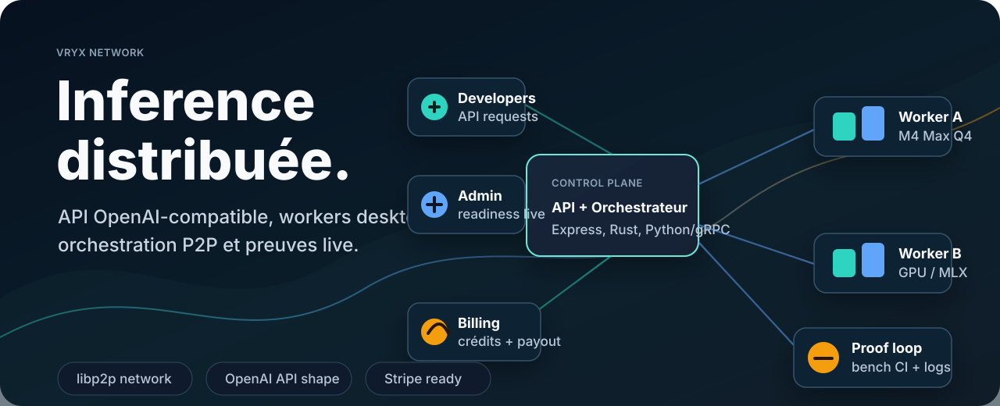
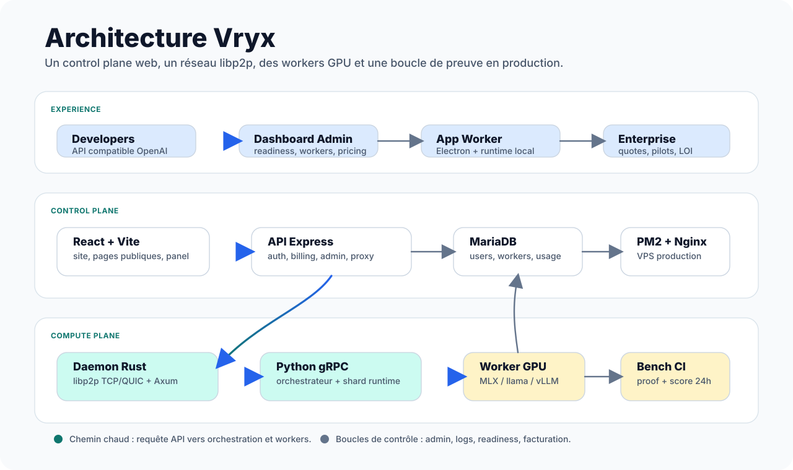
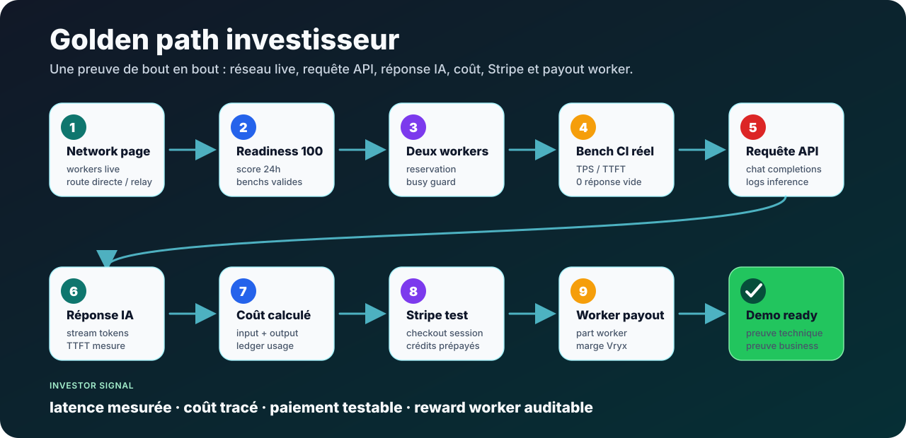
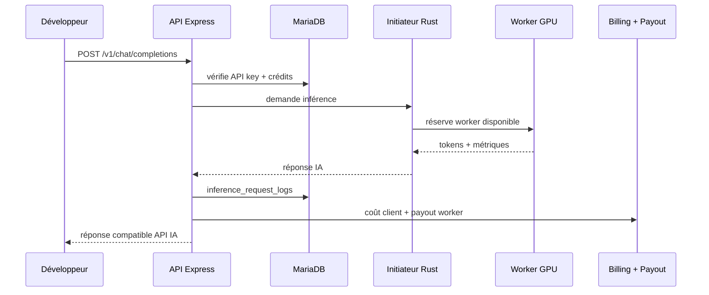

<p align="center">
  
</p>

# Vryx

**Vryx est une infrastructure d’inférence IA distribuée** : une API compatible OpenAI, un réseau de workers desktop, un daemon Rust/libp2p, un runtime Python/gRPC, un dashboard admin, une facturation par crédits et une boucle de preuve technique pour montrer que le réseau répond vraiment.

Le projet vise une alternative pragmatique aux datacenters GPU classiques : utiliser de la capacité compute disponible, la rendre observable, facturable, testable et vendable à des clients API ou Enterprise.

---

## CI / Due Diligence

| Workflow | Ce qu’il prouve |
| --- | --- |
| **Investor CI** | Frontend React/Vite, backend API, Rust fmt/clippy/test/build, Python unit tests, Electron smoke build, audits dépendances. |
| **CI Security** | `npm audit`, `cargo audit`, `pip-audit`, scan de secrets committés. |
| **CI Rust Linux** | Build Linux release du daemon avec fmt, clippy et tests. |
| **P2P Staging Bench** | Golden path staging avec seuils TPS, succès, réponses vides et artefacts de preuve. |
| **Worker Release Build** | Builds macOS/Windows du worker Electron et checksums SHA-256 pour release. |

Les workflows sont conçus pour être lisibles par un CTO/investisseur : chaque couche critique a un job nommé explicitement, et les jobs dépendants de secrets externes se déclenchent seulement quand l’environnement le permet.

---

## Ce que Vryx prouve

| Signal | Ce qui existe dans le repo |
| --- | --- |
| **API IA** | Endpoint OpenAI-compatible, clés API, logs inference, coût calculé par requête. |
| **Workers actifs** | App desktop, heartbeat authentifié, daemon Rust, réservation worker, runtime GPU local. |
| **Réseau P2P** | libp2p TCP/QUIC, relay fallback, diagnostic direct, orchestration initiateur/worker. |
| **Readiness investisseur** | Score de production readiness, golden path, benchmarks TPS/TTFT, détection des réponses vides. |
| **Business loop** | Stripe checkout, crédits prépayés, billing ledger, worker payout ledger, pipeline Enterprise. |
| **Worker payouts** | Classes worker, score qualité, anti-fraude, KYC léger, batch payout et ledger auditable. |
| **Ops** | PM2, Nginx, MariaDB, observability admin, scripts de déploiement VPS. |

---

## Architecture

<p align="center">
  
</p>

### Lecture rapide

1. Un développeur appelle l’API Vryx avec le format attendu par les outils OpenAI-compatible.
2. L’API Express authentifie, vérifie les crédits, choisit un modèle et journalise la requête.
3. L’orchestrateur contacte l’initiateur Rust, qui réserve un worker disponible sur le réseau libp2p.
4. Le runtime Python/gRPC exécute l’inférence via MLX, llama.cpp ou vLLM selon la machine.
5. La réponse IA revient avec tokens, latence, TTFT, TPS, coût et trace technique.
6. Le billing ledger débite le client et le worker payout ledger calcule la part contributeur.
7. Les dashboards admin et publics affichent workers live, readiness, benchmarks et état système.

---

## Golden Path Demo

<p align="center">
  
</p>

Le golden path est le scénario qui doit être montrable en démo investisseur :

- page network avec workers live ;
- readiness à 100 quand les preuves techniques sont réunies ;
- au moins deux workers actifs pour illustrer la capacité réseau ;
- benchmark CI réel avec TPS, TTFT et zéro réponse vide ;
- requête API OpenAI-compatible ;
- réponse IA non vide ;
- coût calculé et inscrit dans le ledger ;
- Stripe test pour recharger les crédits ;
- worker payout visible pour prouver l’économie réseau.

---

## Monorepo

```text
Vryx/
├── website/                    # Front React, API Express, MariaDB local
│   ├── src/                    # Pages publiques, dashboard admin, account, pricing
│   └── server/src/             # Auth, billing, inference logs, workers, admin API
├── nodeAndWorker/              # Réseau et inférence distribuée
│   ├── rust-daemon/            # Daemon Rust libp2p + Axum
│   ├── proto/vryx.proto        # Contrat gRPC
│   ├── python-inference/       # Orchestrateur, workers, MLX, llama/vLLM, batching
│   └── scripts/                # Benchmarks, smoke tests, diagnostics VPS
├── AppMacos/                   # Application worker desktop Electron
├── docs/                       # Data room, sécurité, compliance, golden path, runbooks
├── website_deploy.py           # Déploiement site + API Node vers le VPS
├── vps_deploy.py               # Déploiement bootstrap / daemon Rust
└── README.md                   # Cette vitrine
```

---

## Composants

| Couche | Stack | Rôle |
| --- | --- | --- |
| **Frontend** | React 19, Vite, TypeScript, Tailwind | Site, pages clients/workers, compte, admin, network status. |
| **API** | Node.js, Express, JWT, Zod | Auth, API keys, workers, billing, admin, observability, proxy P2P. |
| **Database** | MariaDB | Users, workers, sessions, usage, pricing, credits, payouts, Enterprise quotes. |
| **Daemon** | Rust, libp2p, Axum | Peer identity, transport P2P, relay/direct, commands, heartbeat. |
| **Inference** | Python, gRPC, MLX, llama.cpp, vLLM | Reservation, pipeline, shard runtime, benchmarks, token streaming. |
| **Desktop** | Electron + React | Worker app pour contribuer du compute local. |
| **Production** | VPS, PM2, Nginx | Site statique, API, health checks, deploy scripts. |

---

## Flux d’une requête API



---

## Production Readiness

Le score readiness est fait pour éviter les démos floues. Il combine :

- workers live et route P2P ;
- benchmarks récents ;
- taux de succès ;
- zéro réponse vide ;
- TTFT p95 ;
- decode TPS ;
- coût et tokens journalisés ;
- derniers événements d’observability.

Endpoints utiles :

| Endpoint | Accès | Usage |
| --- | --- | --- |
| `GET /api/public/golden-path-status?hours=24` | Public redacted | Preuve live utilisable en démo. |
| `GET /api/admin/production-readiness?hours=24` | Admin | Score détaillé, blockers, warnings, actions. |
| `GET /api/admin/inference/summary?hours=24` | Admin | TPS, TTFT, latence, tokens, coûts. |
| `GET /api/admin/observability/health` | Admin | PM2, systemd initiateur, disque, health runtime. |

---

## Démarrage local

Prérequis : **Node.js 20+** et Docker pour MariaDB.

```bash
cd website
cp server/env.example server/.env

npm run install:all
npm run docker:db
npm run dev
```

Vérifier l’API :

```bash
curl -s http://127.0.0.1:4000/api/health
```

Tests ciblés côté API :

```bash
npm run test:production-readiness --prefix website/server
npm run test:inference-metrics --prefix website/server
npm run test:pricing-models --prefix website/server
```

Build frontend :

```bash
npm run build --prefix website
```

---

## Déploiement VPS

Le déploiement site + API se fait depuis la racine du repo :

```bash
export VRYX_VPS_SSH_PASSWORD='...'
python3 website_deploy.py
```

Le script :

- build `website/dist` ;
- archive le front et `website/server` sans `.env` ;
- déploie dans `/var/www/vryx` par défaut ;
- installe les dépendances serveur avec `npm ci --omit=dev` ;
- redémarre `vryx-api` avec PM2 ;
- vérifie `/api/health` en local VPS.

Pour le bootstrap / daemon Rust, utiliser :

```bash
python3 vps_deploy.py
```

---

## Pages et surfaces produit

| Surface | Chemin |
| --- | --- |
| Site public | `/`, `/workers`, `/clients`, `/network`, `/pricing` |
| Espace compte | `/compte`, crédits, clés API, usage |
| Admin readiness | `/admin/production-readiness` |
| Admin observability | `/admin/observability` |
| Admin pricing | `/admin/parametres/pricing` |
| Admin workers | `/admin/workers` |
| Enterprise pipeline | `/admin/enterprise` |

---

## Documentation

| Document | Contenu |
| --- | --- |
| [`docs/INFRASTRUCTURE_A_Z.md`](./docs/INFRASTRUCTURE_A_Z.md) | Architecture complète, routes, tables, daemon, runtime. |
| [`docs/GOLDEN_PATH_PRODUCTION_READINESS.md`](./docs/GOLDEN_PATH_PRODUCTION_READINESS.md) | Contrat golden path, métriques et benchmarks. |
| [`docs/INVESTOR_DATA_ROOM.md`](./docs/INVESTOR_DATA_ROOM.md) | Positionnement, preuves, roadmap, risques, data room. |
| [`docs/investor-data-room/README.md`](./docs/investor-data-room/README.md) | Data room investisseur structurée pour lecture non-développeur. |
| [`docs/SECURITY_ARCHITECTURE_VRYX.md`](./docs/SECURITY_ARCHITECTURE_VRYX.md) | Sécurité API, workers, données et production. |
| [`docs/COMPLIANCE_AND_DATA_PROTECTION.md`](./docs/COMPLIANCE_AND_DATA_PROTECTION.md) | Protection données, DPA, no-retention, incidents. |
| [`docs/compliance/README.md`](./docs/compliance/README.md) | Pack conformité B2B : RGPD, retention, logs, datasets, contrats. |
| [`docs/VRYX_KNOWLEDGE_AI_AND_FINE_TUNE_STUDIO.md`](./docs/VRYX_KNOWLEDGE_AI_AND_FINE_TUNE_STUDIO.md) | Module Knowledge AI, RAG et Fine-Tune Studio. |
| [`docs/AFFILIATE_PROGRAM.md`](./docs/AFFILIATE_PROGRAM.md) | Programme affiliation : codes, tracking, commissions limitées, anti-fraude. |
| [`docs/WORKER_RELEASE_RUNBOOK.md`](./docs/WORKER_RELEASE_RUNBOOK.md) | Build et release worker desktop. |

---

## Vision

Vryx n’est pas seulement une interface autour d’un modèle. Le produit assemble quatre preuves dans un même système :

1. **Preuve technique** : des workers réels génèrent des tokens avec métriques.
2. **Preuve opérationnelle** : l’infra est observable, déployable et diagnostiquable.
3. **Preuve économique** : une requête a un coût, un client paie, un worker est rémunéré.
4. **Preuve commerciale** : Enterprise quotes, pilotes et lettres d’intérêt peuvent être suivis dans le produit.

Le but est simple : transformer du compute distribué en capacité IA achetable.

---

<p align="center">
  <strong>Vryx</strong> · distributed AI inference network · built for live proof, not slideware
</p>
