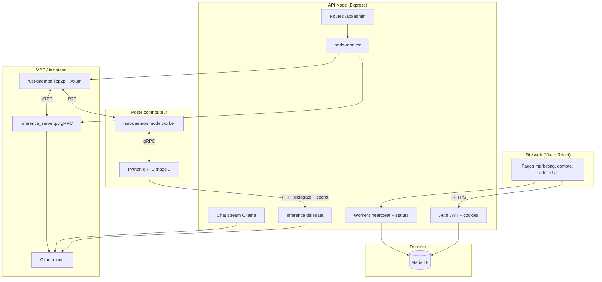

# Vryx — documentation produit et technique

Ce document décrit la vision, les mécanismes économiques et techniques, et l’organisation du dépôt **Vryx**. Il s’appuie sur le code et les scripts du monorepo tel qu’il existe aujourd’hui.

---

## 1. En une phrase

**Vryx** est une infrastructure d’inférence et de calcul distribué qui vise à **concurrencer les datacenters** en s’appuyant sur un réseau de machines (GPU des particuliers, workers, initiateur sur VPS), avec une **couche produit** (site, comptes, admin) et une **couche réseau** (libp2p, gRPC, orchestration de charges) conçue pour la latence, la résilience et une **séparation claire** entre ce qui tourne chez le contributeur et ce qui reste sur le serveur.

---

## 2. Pour qui, et quel problème

### 2.1 Développeurs et équipes produit

- Besoin d’**inférence moins chère** qu’un fournisseur cloud classique, avec un positionnement type **API familière** (écosystème compatible usages courants d’inférence).
- Le site met en avant une **expérience développeur** (tarification, simulateur, pages « clients ») et un discours **sécurité / confidentialité par conception**.

### 2.2 Détenteurs de GPU (« gamers » et contributeurs matériels)

- Proposition : **monétiser la disponibilité** du GPU sans imposer le stockage d’énormes modèles sur le poste du contributeur.
- Le modèle documenté dans le code et `INSTALLATION.md` : les workers passent par un **pont de délégation** vers le VPS pour l’inférence LLM ; le poste exécute la logique réseau et les charges orchestrées, pas un téléchargement massif de poids de modèle côté contributeur.

### 2.3 Opérateurs et administrateurs

- **Panel admin** (utilisateurs, nœud, workers en direct, santé Ollama, chat de test, stress tests).
- **Surveillance** du nœud initiateur et des processus (daemon Rust, serveur Python d’inférence) via un module serveur dédié.

---

## 3. Concepts d’architecture réseau (produit)

Le storytelling du front (`website/src/data/storytelling.ts`) formalise deux idées structurantes :

### 3.1 La « Course » (competitive redundancy)

Après découpage mémoire / blocs de travail, un même bloc peut être confié à **plusieurs GPU en parallèle**. Le **premier résultat valide** débloque la suite du pipeline ; les tentatives redondantes sur ce bloc peuvent être interrompues. Objectif : **réduire la latence perçue** et absorber l’instabilité des connexions résidentielles.

### 3.2 Le « Relais » (pipeline parallelism)

Les très grands modèles sont pensés en **chaîne** : des groupes de machines enchaînent les étages de calcul pour **ne saturer ni la VRAM ni un seul lien** sur un poste isolé.

Ces notions nourrissent les pages publiques (`/race-pool`, `/comparatif`, sections d’accueil) et le **simulateur de coûts** (`/simulateur`), qui restent des **ordres de grandeur indicatifs** (non contractuels), comme rappelé dans les textes du site.

---

## 4. Vue d’ensemble technique du monorepo

### 4.1 Couches

| Couche | Rôle principal |
|--------|----------------|
| **Front React** | Vitrine, parcours utilisateur, simulateur, admin. |
| **API Express** | Authentification, persistance utilisateurs/workers, délégation d’inférence sécurisée, streaming chat admin, agrégation monitoring. |
| **MariaDB** | Comptes, flags admin, métadonnées workers (heartbeat, ports, tokens agrégés, etc.). |
| **Daemon Rust** | Nœud **DePIN** : libp2p (Kademlia, relay, identify, etc.), échange de tenseurs / requêtes, API locale Axum (dashboard, chat pour tests), intégration scheduler multi-workers. |
| **Serveur Python gRPC** | Implémente `InferenceService` du proto : traitement, capacités, ping runtime shard, stages 1 (VPS) vs 2 (worker avec délégation HTTP). |
| **Ollama** | Moteur LLM sur le **VPS** pour les chemins documentés (chat API, delegate). |
| **App macOS (Electron + Vite)** | Client desktop léger qui dialogue avec l’API locale du daemon (statut, WebSocket stream). |

---

## 5. Dépôt : arborescence logique

À la racine du monorepo :

- **`website/`** — Application web principale (`npm run dev` lance Vite + API en parallèle).
  - `website/src/` — Composants, pages, données de contenu (storytelling, catalogues GPU, modèles).
  - `website/server/` — API Node, `node-monitor.js`, `chat.js`.
  - `website/docker-compose.yml` — MariaDB pour le développement.
  - `website/INSTALLATION.md` — Procédure détaillée BDD, JWT, workers, proto.
- **`nodeAndWorker/`** — Cœur distribué : proto, daemon Rust, inférence Python, scripts de démarrage et tests.
- **`AppMacos/`** — Application Electron (shell + React) pour rattacher / visualiser le nœud local.
- **`scripts/github-vryx-bootstrap.sh`** — Création du dépôt GitHub privé et push (usage interne).
- **Rust** — Le crate du daemon distribué est **`nodeAndWorker/rust-daemon/`** (workspaces Cargo à la racine et sous `nodeAndWorker/` déclarent le membre `rust-daemon` ; les sources sont dans ce sous-dossier).

Les artefacts volumineux (archives `.tar.gz`, builds de release, `node_modules`, etc.) sont exclus du versioning via `.gitignore`.

---

## 6. Site web (`website/`)

### 6.1 Stack front

- **React 19**, **TypeScript**, **Vite 8**, **Tailwind CSS 4**, **Framer Motion**, **React Router 7**.
- Mise en page **responsive** (mobile d’abord dans l’intention produit), composants de marque (`VryxLogo`), icônes SVG centralisées (`components/icons`).

### 6.2 Parcours et routes principales

Déclarées dans `website/src/App.tsx` :

| Chemin | Intention |
|--------|-----------|
| `/` | Accueil, sections hero, workers, clients, confidentialité, CTA. |
| `/workers` | Page contributeurs : installation, FAQ, promesse de revenus. |
| `/clients` | Page développeurs : API, tarifs, confiance. |
| `/race-pool` | Explication « Course et Relais ». |
| `/simulateur` | Simulation de coûts / revenus (indicatif). |
| `/comparatif` | Solo vs pool, jackpot vs revenus réguliers. |
| `/compte` | Espace compte utilisateur. |
| `/panel/modeles` | Panel modèles côté utilisateur connecté. |
| `/connexion`, `/inscription` | Auth. |
| `/admin`, `/admin/utilisateurs`, `/admin/noeud` | **Espace admin** (accès contrôlé côté API + rôle `is_admin`). |

### 6.3 Contenu éditorial

Les textes marketing et légaux légers sont centralisés dans `website/src/data/` (`storytelling.ts`, `workersContent.ts`, `clientsContent.ts`, `racePoolContent.ts`, etc.), ce qui sépare **donnée éditoriale** et **composants de présentation**.

---

## 7. API serveur (`website/server/src/index.js`)

### 7.1 Sécurité de base

- **Helmet**, **CORS** configurable (`CORS_ORIGIN`), **rate limiting** sur les routes sensibles (auth, chat, delegate, workers).
- **JWT** stocké en cookie HTTP (`velocity_token`), durée configurable (`JWT_EXPIRES_DAYS`), cookie **secure** en production (`COOKIE_SECURE=true`).
- **Validation** des entrées avec **Zod** (email, mot de passe avec règles de complexité).
- **Secret obligatoire** : `JWT_SECRET` (minimum 32 caractères) — sinon arrêt au démarrage.

### 7.2 Admins application

- Liste d’e-mails **promus administrateurs** au démarrage : surcharge via variable d’environnement `ADMIN_EMAILS` (virgules), sinon valeur par défaut dans le code.
- Les comptes correspondants reçoivent le flag `is_admin` en base.
- Référence de configuration : `website/server/env.example`.

### 7.3 Endpoints publics / auth (aperçu)

- `GET /api/health` — Santé API.
- `POST /api/auth/register`, `POST /api/auth/login`, `POST /api/auth/logout`, `GET /api/auth/me`.
- `POST /api/workers/heartbeat` — Enregistrement / mise à jour des workers (limiteur dédié).
- `POST /api/workers/inference-delegate` — **Délégation d’inférence** : le worker distant authentifie la requête (secret partagé côté serveur `WORKER_INFERENCE_DELEGATE_SECRET` et en-tête côté client) ; l’**exécution LLM** a lieu sur le VPS via Ollama.
- `GET /api/workers/status` — Statut agrégé pour le front.
- `POST /api/chat/stream`, `GET /api/chat/health` — Chat streaming branché sur **Ollama** (`chat.js`).

### 7.4 Espace `/api/admin`

Toutes les routes sont protégées par un middleware **`requireAdmin`**.

Exemples utiles pour comprendre le produit :

- Statistiques site, liste utilisateurs, promotion / révocation admin, suppression compte.
- **Workers live** : heartbeats récents pour la sidebar temps réel.
- **Workers enregistrés** : vue base de données.
- **Nœud** : statut, liste des workers vus par le daemon, historique, tests et stress tests (pilotage via `node-monitor`).
- **Ollama** : santé et tags modèles.
- **P2P / shard-runtime** : métadonnées pour le panneau de supervision.
- Streams de chat (dont proxy vers le chat P2P du daemon initiateur pour les essais admin).

### 7.5 Intégration initiateur

- Variable `VRYX_INITIATOR_CHAT_URL` (défaut `http://127.0.0.1:3031`) : URL de l’API **Axum** du daemon en mode initiateur pour certaines fonctions admin (chat P2P).

### 7.6 Module `node-monitor.js`

Rôle : **inspecter l’hôte** où tourne l’API (processus `rust-daemon`, `inference_server.py`), agréger **CPU, RAM, GPU** si disponible, conserver un **historique glissant**, exposer des actions de **test / stress** E2E. Conçu pour **ne pas planter** l’admin si aucun daemon n’est lancé (listes vides, métriques système quand même).

---

## 8. Base de données (MariaDB)

Tables créées / migrées au démarrage (logique dans `index.js`) :

- **`users`** — `email`, hash mot de passe, `is_admin`, `last_login_at`, horodatage.
- **`workers`** — `peer_id`, mode (`worker` / `initiator` / `bootstrap`), ports gRPC / P2P, IP publique, version, compteurs P2P et **tokens générés**, modèle déclaré, lien `user_id` optionnel, heartbeats.

Cela alimente le **tableau de bord admin** et la vision « réseau vivant » du produit.

---

## 9. Couche distribuée (`nodeAndWorker/`)

### 9.1 Contrat gRPC : `proto/vryx.proto`

Définit le service **`InferenceService`** et les messages clés :

- **`Process`** — Entrée / sortie tenseurs avec métriques de temps et, côté réponse, **tokens LLM** (`prompt_tokens`, `completion_tokens`, `total_tokens`) et **latence délégation VPS** (`vps_delegate_ms`), distincts des messages P2P.
- **`ReportCapabilities` / `CapabilitiesAck`** — RAM disponible, device, version runtime, estimation réseau, taille max de shard éphémère : base pour le **scheduler** tensor-parallèle.
- **`PingShardRuntime`** — Vérification / warmup du **runtime shard** sans persistance disque.
- **Shard** — `ShardInit`, `ShardLoad`, `ForwardPass`, `ShardUnload` : pipeline de **shards en RAM** (session, TTL, plages de couches, chunks, activations).

Après modification du `.proto`, la doc d’installation indique la régénération des stubs **Python** (`grpc_tools.protoc`) ; le daemon **Rust** s’appuie sur **tonic-build** en build Cargo.

### 9.2 Daemon Rust (`nodeAndWorker/rust-daemon/`)

- CLI **clap** : ports gRPC / P2P, mode `bootstrap` | `worker` | `initiator`, adresse bootstrap, URL API pour heartbeat, fichier de clé libp2p, `user_id`, port **Axum** local (`api_port`, défaut 3031), nom de modèle.
- Réseau **libp2p** : TCP, Noise, Yamux, Kademlia, identify, relay, DCUtR, AutoNAT, MDNS (selon compilation et options), **request-response** pour le protocole tenseur / LLM.
- **API locale** pour l’Electron et les tests : CORS, routes de statut, chat, streaming WebSocket (voir usages dans `AppMacos/src/useVryxNode.ts` : `http://127.0.0.1:3031`, WebSocket `ws://127.0.0.1:3031/ws/stream`, et POST chat vers `3030` selon la config du binaire lancé).
- Métriques enrichies dans les réponses tenseurs : tokens LLM, messages P2P in/out, identifiants de session shard, nombre de workers utilisés par le scheduler, etc.

### 9.3 Serveur Python (`nodeAndWorker/python-inference/`)

- **`inference_server.py`** — Implémente le service gRPC.
  - **Stage 1** (initiateur / VPS) : appels **Ollama uniquement en local** (`127.0.0.1:11434` par défaut).
  - **Stage 2** (worker chez un contributeur) : **pas de modèle local** ; renvoi vers l’API **`/api/workers/inference-delegate`** avec secret `X-Vryx-Inference-Delegate`.
- **`shard_runtime.py`** — Runtime de shards **éphémères en RAM** (dtypes dédiés `vryx.shard.*`).

### 9.4 Scripts et tests

Shell et PowerShell pour **E2E**, **fault tolerance**, **WAN** ; scripts `start-worker.sh`, `start-initiator.sh`, `test_local_p2p.sh`, etc. Ils matérialisent les scénarios d’exploitation et de QA du réseau.

---

## 10. Application macOS (`AppMacos/`)

- Stack **Electron** + **React** + **Vite**, build desktop pour macOS.
- Hook **`useVryxNode`** : polling du **statut** du daemon local, WebSocket pour un **flux de tokens** simulé / streamé, action `startChat` vers l’endpoint chat local.
- Objectif produit : **baisse de friction** pour un contributeur qui veut voir crédits / activité sans passer par le navigateur.

---

## 11. Chat et inférence : deux chemins distincts (à retenir)

1. **Chat admin / API Node** (`chat.js`) — Parle à **Ollama** sur le VPS (REST `/api/chat`, streaming NDJSON pour le front). C’est le chemin « classique » site ↔ VPS.
2. **Workers distants** — Par le **delegate HTTP** + **gRPC stage 2**, le calcul LLM reste **côté infrastructure centralisée** ; le poste worker reste une **extension réseau** contrôlée, pas un datacenter personnel de modèles.

Cette séparation est un pilier **éthique et opérationnel** du projet (surface d’attaque, conformité aux promesses « pas de gros modèle chez le contributeur »).

---

## 12. Confidentialité et narration « privacy by design »

Le site affiche une ligne directrice : le worker reçoit des **opérations mathématiques isolées**, pas le modèle complet ni les données utilisateur en clair ; **VRAM libérée** après tâche ; surface d’attaque réduite. C’est aligné avec l’architecture technique (shards, délégation, pas de poids LLM imposé sur le disque du contributeur dans le flux documenté).

---

## 13. Développement et déploiement

### 13.1 Démarrage rapide (site + API)

Voir **`website/INSTALLATION.md`** : Node 20+, `npm run install:all`, copie des `env.example`, Docker MariaDB avec **`docker compose --env-file server/.env`**, `npm run dev`, vérification `curl` sur `/api/health`.

### 13.2 Variables d’environnement clés (non exhaustif)

| Variable | Rôle |
|----------|------|
| `JWT_SECRET`, `JWT_EXPIRES_DAYS`, `COOKIE_SECURE`, `CORS_ORIGIN` | Auth et durcissement prod. |
| `DB_*` | Connexion MariaDB. |
| `ADMIN_EMAILS` | Liste d’admins applicatifs. |
| `OLLAMA_HOST`, `OLLAMA_MODEL` | Cible Ollama pour l’API Node et les scripts. |
| `WORKER_INFERENCE_DELEGATE_SECRET` / `VRYX_INFERENCE_DELEGATE_SECRET` | Secret partagé delegate (voir INSTALLATION). |
| `VRYX_INITIATOR_CHAT_URL` | URL du daemon initiateur pour l’admin. |
| `WORKER_LIVE_SEC` | Fenêtre de fraîcheur des heartbeats « live ». |

### 13.3 Docker

`website/docker-compose.yml` + `website/docker/mariadb/init.sql` pour une base **prête pour le dev** avec schéma initial cohérent avec les migrations Node.

---

## 14. Glossaire interne

| Terme | Signification dans ce dépôt |
|-------|------------------------------|
| **Vryx** | Nom produit / infrastructure. |
| **Worker** | Nœud réseau qui participe aux calculs ; heartbeat vers l’API ; mode gRPC souvent « stage 2 ». |
| **Initiateur** | Nœud central typiquement sur **VPS**, amorce P2P, Ollama local, stage 1 Python. |
| **Bootstrap** | Point d’entrée d’amorçage du réseau libp2p (pair de confiance initial). |
| **Delegate** | Endpoint HTTP sécurisé pour exécuter l’inférence sur le VPS au nom d’un worker distant. |
| **Shard** | Morceau de modèle / activation traité en session RAM avec cycle Init → Load → Forward → Unload. |
| **Course / Relais** | Concepts produit de redondance compétitive et de pipeline par étages. |
| **DePIN** | Decentralized Physical Infrastructure Network — réseau physique (GPU) incentivé. |

---

## 15. État du dépôt et périmètre

Ce dépôt regroupe :

- une **vitrine et une plateforme web** complète (marketing, auth, admin, simulateurs) ;
- une **API de production** orientée sécurité et observabilité ;
- un **runtime distribué** (Rust + Python + proto) avec métriques fines (tokens LLM vs charge P2P, scheduler, shards) ;
- un **client macOS** de proximité avec le daemon.

Les éléments « business » (contrats, SLA, conformité RGPD détaillée, facturation) peuvent vivre hors code ou dans des pages légales à compléter selon ton offre commerciale ; ici, la base technique et le discours produit sont **cohérents** et **traçables** dans les fichiers cités.

---

## 16. Poursuivre la lecture

- **`README.md`** (racine) — Entrée du dépôt et lien GitHub bootstrap.
- **`website/INSTALLATION.md`** — Guide opérationnel le plus à jour pour installer et éviter les pièges (BDD, proxy Vite, delegate worker, régénération proto).

---

*Document généré pour structurer la connaissance du projet Vryx ; à faire évoluer en même temps que le code et l’offre.*
