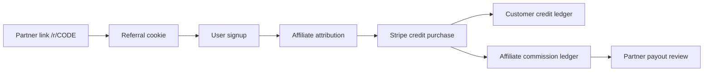

# Vryx Affiliate Program

Last updated: 2026-05-23

## Business Rule

Default recommendation:

- 10% commission for 12 months;
- optional 5% commission for 24 months;
- cap per referred customer by default;
- no lifetime commission except for a negotiated strategic partner.

This protects Vryx margin while still making partner acquisition attractive.

## Product Scope

Implemented foundation:

- referral codes;
- affiliate links via `/r/:code`;
- referral cookie tracking;
- attribution on account creation;
- time-limited attribution;
- partner commission ledger on Stripe credit purchase;
- client-level commission cap;
- partner account dashboard API;
- admin partner list/create API;
- duplicate commission prevention by source transaction.

## Flow

## Tables

| Table | Purpose |
| --- | --- |
| `affiliate_partners` | Partner profile, code, status and commission terms. |
| `affiliate_attributions` | One active attribution per customer account. |
| `affiliate_commission_ledger` | Pending/approved/paid partner commission rows. |

## Anti-Fraud Controls

Current controls:

- one attribution per user account;
- commission only from paid Stripe checkout sessions;
- unique commission row per payment session and partner;
- partner status can be paused or blocked;
- attribution expires after configured months;
- client cap limits runaway commissions;
- IP and user-agent hashes are stored for review without exposing raw values.

Next controls:

- self-referral detection;
- minimum paid amount before payout;
- manual approval threshold;
- payout KYC;
- fraud scoring for suspicious signup/payment patterns.

## API Surfaces

Public:

- `GET /r/:code`
- `POST /api/referrals/track`

Account:

- `GET /api/account/affiliate`
- `POST /api/account/affiliate`

Admin:

- `GET /api/admin/affiliates`
- `POST /api/admin/affiliates`

