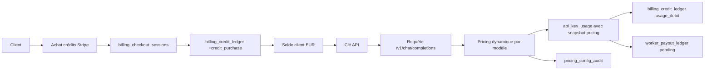

# Vryx Billing Money Path

Objectif : prouver que Vryx est une entreprise facturable, pas seulement une technologie.

## Golden Path Argent



## Tables Source De Vérité

- `billing_credit_ledger` : solde client, achats, débits usage, ajustements admin, refunds.
- `billing_checkout_sessions` : sessions Stripe Checkout et statut paiement.
- `api_key_usage` : tokens, coût total, coût input/output, mode billing, snapshot pricing.
- `worker_payout_ledger` : montant dû à chaque worker, statut pending/payable/paid, snapshot pricing.
- `pricing_config`, `model_catalog`, `pricing_config_audit` : prix officiels et audit admin.

MariaDB reste la source de vérité pour l'argent. Redis/Valkey peut accélérer l'idempotence et les files, mais ne remplace pas ces tables.

## Routes

Client :

```text
GET  /api/account/billing
POST /api/account/billing/checkout
POST /v1/chat/completions
```

Stripe :

```text
POST /api/billing/stripe/webhook
```

Admin :

```text
GET  /api/admin/billing/summary
GET  /api/admin/billing/proof
POST /api/admin/billing/users/:id/credit
```

## Acceptance Investisseur

Le endpoint `/api/admin/billing/proof` vérifie :

- packs prépayés `50`, `100`, `500`, `2000` EUR ;
- Stripe Checkout configuré ;
- ledger client prêt ;
- usage API débité ;
- snapshot pricing enregistré dans `api_key_usage` ;
- payout worker pending créé ;
- audit pricing présent ;
- enforcement crédit configuré.

## Test Local

Depuis `website/server` :

```bash
npm run test:money-path
```

Ce test simule :

- un solde client prépayé ;
- un coût dynamique input/output avec remise volume ;
- un débit de crédits ;
- un payout worker ;
- l'absence de payout sur requête failed.
