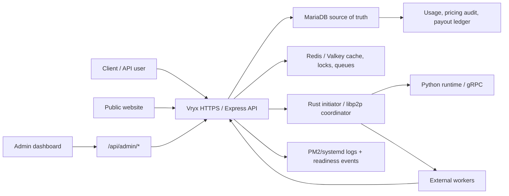
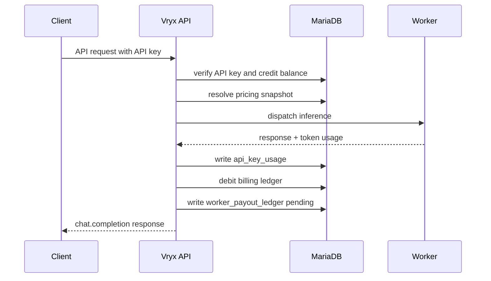

# Security Architecture Vryx

Version: 2026-05-23  
Scope: public website, Express API, OpenAI-compatible API, worker plane, Rust/libp2p initiator, Python/gRPC runtime, MariaDB billing ledger, Redis/Valkey coordination, admin dashboard.

## 1. Executive Summary

Vryx is an AI infrastructure marketplace: customers consume an OpenAI-compatible API, external workers provide compute, and the platform records pricing, credits, usage, and payouts. The security posture must therefore be closer to a B2B infrastructure provider than a classic SaaS front-end.

The production target is fail closed:

- the API must not start in production without strong session, worker, and internal secrets;
- public endpoints expose redacted aggregate proof only;
- full worker inventory, IPs, ports, payout, readiness details, and operational traces are admin-only;
- worker routes require shared or rotated worker credentials;
- internal endpoints require localhost plus an internal token;
- MariaDB remains the source of truth for money, users, audit, usage, and payout;
- Redis/Valkey is used only for cache, locks, queues, idempotency, and live state;
- runtime and worker services are isolated by firewall, process boundaries, and service-level logs.

This document is designed for investor technical diligence. It describes the current architecture, implemented controls, residual risks, and the next audit plan.

## 2. Architecture Overview

The critical separation is between public proof and operational control. Public proof shows that the network exists and is measurable. Operational control remains authenticated and admin-only.

## 3. Trust Zones

| Zone | Examples | Access Model | Data Class |
| --- | --- | --- | --- |
| Public website | `/`, `/network`, `/workers`, `/api/public/*` | anonymous | redacted aggregates |
| Client account | `/api/account/*`, API keys, billing | JWT session or API key | user data, balances, usage |
| OpenAI-compatible API | `/v1/chat/completions` | API key | prompts, responses, usage cost |
| Worker plane | `/api/workers/*`, shard serve | worker secret or rotated worker token | peer identity, heartbeats, capabilities |
| Internal runtime | live peers, token stream callbacks, gRPC | localhost plus internal token or per-stream secret | internal orchestration |
| Admin plane | `/api/admin/*` | JWT plus admin role | raw workers, payout, DB-derived proof |
| Data plane | MariaDB, Redis/Valkey | private network/process env | money, audit, cache, locks, queues |

The design assumption is zero trust between zones. A public route must not reveal internal identifiers. A worker route must not accept unauthenticated traffic in production. An admin route must not depend on front-end hiding.

## 4. Production Security Gates

The API validates critical environment at startup. In production, the server must fail before serving traffic if required controls are missing:

- `JWT_SECRET` must exist and be at least 32 characters;
- `VRYX_WORKER_SECRET` or `WORKER_INFERENCE_DELEGATE_SECRET` must exist and be at least 32 characters;
- `VRYX_INTERNAL_TOKEN` must exist and be at least 32 characters;
- `COOKIE_SECURE=true` is required;
- `CORS_ORIGIN` must not contain `*`, localhost, `127.0.0.1`, or loopback values;
- `ALLOW_UNSECURE_WORKERS=1` is ignored in production;
- Redis/Valkey can be required in production with `REDIS_REQUIRED_IN_PROD=1`.

This converts missing security configuration into a deployment failure instead of a silent insecure mode.

## 5. Route Separation

### Public routes

Public routes are used for marketing, transparency, model catalog, pricing, and readiness proof. They must return only aggregated or redacted data.

Examples:

- `/api/public/pricing`;
- `/api/public/models`;
- `/api/public/network-status`;
- `/api/public/golden-path-status`;
- `/api/public/benchmarks`.

Public network status uses a redaction policy by default:

- peer IDs become stable public aliases;
- IPs and ports are not returned;
- worker hardware details are generalized;
- exact token counters are bucketed unless explicitly enabled;
- business metrics such as revenue, worker rewards, API revenue, and net margin are hidden unless explicitly enabled.

### Client routes

Client routes require JWT sessions or API keys. They expose only the current customer's keys, usage, credits, and billing state. Money movements must be written to MariaDB ledgers.

### Worker routes

Worker routes require worker authentication. These routes handle heartbeats, status discovery, shard access, and worker command acknowledgement. They are not browser-public.

### Admin routes

Admin routes live under `/api/admin/*` and require `requireAdmin`. Admin routes may expose raw peer IDs, IPs, ports, command history, payout, health probes, readiness details, and audit data.

## 6. Worker Authentication

Workers authenticate using `Authorization: Bearer <token>`, `x-worker-token`, or a token query parameter for legacy compatibility.

Accepted credentials:

- global worker secret: `VRYX_WORKER_SECRET`;
- legacy alias: `WORKER_INFERENCE_DELEGATE_SECRET`;
- per-worker current secret hash stored in `workers.worker_secret_hash`;
- per-worker next secret hash during rotation in `workers.worker_next_secret_hash`.

Secret comparison uses timing-safe comparison for global and internal tokens. Per-worker secrets are stored as SHA-256 hashes, with expiration support for current and next secrets.

Production behavior:

- no configured worker secret means the API refuses to start;
- insecure worker mode is ignored in production;
- `/api/workers/status` requires worker auth;
- `/api/internal/shard-serve/*` requires worker auth;
- worker heartbeat writes only after authentication succeeds.

## 7. Internal Runtime Security

The runtime plane contains the Rust initiator, libp2p coordination, Python gRPC, token-stream callbacks, and local helper endpoints. This surface is powerful and must remain private.

Implemented controls:

- internal live peer discovery is localhost-only;
- internal live peer discovery requires `VRYX_INTERNAL_TOKEN`;
- token stream callbacks use one-time per-stream secrets;
- shard serving requires worker authentication;
- JSON request size is limited, with a stricter production default.

Production deployment controls:

- gRPC ports should bind to localhost or a private interface only;
- public firewall should deny direct access to Python runtime ports;
- worker hot-reload or admin-style endpoints must be disabled or private-network only in production;
- systemd services must run with least-privilege users where possible;
- runtime logs must not include prompts, secrets, or full tokens.

## 8. Data Protection Policy

Vryx handles multiple data classes:

| Class | Examples | Storage | Policy |
| --- | --- | --- | --- |
| Identity | email, admin flag, account metadata | MariaDB | authenticated access only |
| Credentials | JWT secret, worker secret, Stripe keys | environment/secrets manager | never committed, rotate after exposure |
| API keys | customer API keys | hash in MariaDB | raw key shown once only |
| Usage | tokens, model, latency, cost | MariaDB | customer/admin scoped |
| Money | credit ledger, API usage cost, payout ledger | MariaDB | source of truth, auditable |
| Worker state | heartbeat, mode, model, capabilities | Redis + MariaDB snapshot | public redacted, admin full |
| Prompts/responses | chat content | request pipeline | no public exposure, retention policy required |
| Benchmarks | TPS, TTFT, status, plan | MariaDB/artifacts | public summarized, admin detailed |

MariaDB remains the system of record for credits, usage, pricing, payout, users, and audits. Redis/Valkey must not be the only store for money or legal data.

## 9. Billing And Payout Integrity

The billing path is designed around explicit ledgers:

Integrity requirements:

- pricing snapshot is stored with usage;
- customer cost is calculated from the same pricing source used by admin and public pages;
- customer balance is debited in MariaDB;
- worker payout is written only after successful request accounting;
- failed or cancelled requests must not create payout;
- retry/idempotency controls must prevent duplicate usage and payout;
- Stripe webhooks must be verified and idempotent before crediting balance.

Current status:

- dynamic pricing, cost calculation, API usage, credit debit, and payout ledger have been validated;
- Stripe checkout/webhook configuration must be completed on the VPS before claiming full Stripe end-to-end in production.

## 10. Public Redaction Rules

Public proof is useful for investors and customers, but it must not become reconnaissance data.

Default public policy:

- show worker counts, model readiness, benchmark summaries, latency/TPS/TTFT;
- show redacted worker aliases only;
- show generalized GPU class/memory tier, not full machine details;
- bucket exact token counters;
- hide revenue, worker rewards, pending payout, net margin, and API revenue;
- hide full benchmark errors;
- hide peer IPs, p2p ports, gRPC ports, and full peer IDs.

Temporary flags for controlled internal demos:

- `VRYX_PUBLIC_EXPOSE_WORKER_DETAILS=1`;
- `VRYX_PUBLIC_EXPOSE_BUSINESS_METRICS=1`.

These flags must stay disabled for normal production traffic.

## 11. Anti-Abuse And DoS Controls

Implemented controls:

- Express rate limiting on auth, login, chat, worker heartbeat, admin ping, and selected admin generation routes;
- production JSON body limit defaults to `1mb`;
- CORS origin validation uses exact allowed origins;
- CSRF origin/referer checks protect session routes;
- worker liveness and scheduler health thresholds prevent stale workers from being selected;
- Redis/Valkey can provide distributed locks and idempotency.

Next controls before larger B2B rollout:

- per-API-key token quota before dispatch;
- per-user concurrent generation limit;
- per-worker heartbeat anomaly scoring;
- suspicious worker quarantine state;
- distributed rate limit backed by Redis;
- queue backpressure with BullMQ for benchmarks, payouts, webhooks, and worker commands;
- max prompt size and max output controls per plan/model;
- customer-level budget caps and hard spend limits.

## 12. Logging, Monitoring, And Audit

Current evidence surfaces:

- PM2/systemd API logs;
- worker heartbeat logs;
- readiness dashboard;
- inference request logs;
- pricing audit table;
- API usage ledger;
- worker payout ledger;
- public benchmark summaries.

Security monitoring roadmap:

- structured security event table for auth failures, worker auth failures, admin actions, worker commands, webhook replay, and API quota violations;
- Sentry or equivalent with sensitive-field scrubbing;
- log retention policy;
- alerting on worker auth failures, abnormal request volume, Redis down, DB write failures, and payout anomalies;
- weekly evidence export for investor data room.

## 13. Secrets And Rotation Policy

Secrets must never be committed. Any secret shared in chat, logs, screenshots, or demos must be rotated.

Secrets in scope:

- `JWT_SECRET`;
- `VRYX_WORKER_SECRET`;
- `WORKER_INFERENCE_DELEGATE_SECRET`;
- `VRYX_INTERNAL_TOKEN`;
- `VRYX_BENCH_TOKEN`;
- `STRIPE_SECRET_KEY`;
- `STRIPE_WEBHOOK_SECRET`;
- Google OAuth client secret;
- database credentials;
- Redis/Valkey password.

Rotation policy:

- rotate immediately after exposure;
- use long random values;
- record rotation date in the data room;
- keep old worker secret only during a bounded migration window;
- expire per-worker next secrets after rotation.

Suggested data room statement:

> All credentials used during investor-readiness testing were rotated after validation.

## 14. Deployment Security

Recommended production baseline:

- API behind HTTPS reverse proxy only;
- `COOKIE_SECURE=true`;
- strict public CORS origins;
- MariaDB bound to localhost/private network;
- Redis/Valkey bound to localhost/private network, password protected, no public exposure;
- Python gRPC bound to localhost/private network;
- systemd services with `Restart=always`;
- public firewall allows only HTTPS/SSH and explicitly required worker P2P ports;
- SSH key-based access preferred over password-based access;
- backups encrypted and tested;
- artifacts/videos stored outside source Git.

Redis/Valkey policy:

- cache and queue instance may be shared initially;
- if BullMQ queues become critical, use `noeviction`;
- never use Redis as sole source of truth for credits, invoices, payouts, pricing, contracts, or user identity.

## 15. Risk Register

| Risk | Impact | Current Control | Next Action |
| --- | --- | --- | --- |
| Missing worker secret in prod | unauthorized worker writes | production startup fail | CI env validation check |
| Public endpoint leaks ops data | recon / competitive leakage | redacted public status | add snapshot tests |
| API key abuse | cost spike / DoS | rate limits, credit checks | Redis distributed quotas |
| Worker spoofing | fake capacity / payout fraud | worker secret, hashes | worker identity attestation |
| Webhook replay | duplicate credits | Stripe signature + idempotency design | Redis + DB event ledger |
| Runtime port exposure | direct gRPC abuse | deployment isolation expected | firewall audit script |
| Prompt leakage in logs | data protection incident | logging discipline | automated scrubbing |
| Admin account takeover | full control plane access | admin role + JWT | MFA / passkeys |
| Queue overload | latency / downtime | rate limits | BullMQ backpressure |
| Secret exposure in demos | credential compromise | rotation policy | post-demo rotation checklist |

## 16. Audit Plan

Phase 1, immediate:

- verify production env gates;
- verify public redaction responses;
- verify worker routes fail without token;
- verify admin routes reject non-admin users;
- verify internal live peers rejects non-localhost and missing token;
- verify no secrets in Git history for current branch;
- verify artifacts are not committed.

Phase 2, B2B pilot:

- add Redis-backed rate limit and idempotency tests;
- add Stripe webhook replay test in CI/staging;
- add worker command audit table;
- add admin action audit table;
- add prompt retention toggle;
- add security event dashboard.

Phase 3, enterprise:

- external pentest;
- DPA finalized;
- subprocessors and worker terms finalized;
- SOC 2 style control mapping;
- customer-specific data retention settings;
- signed worker builds and update channel.

## 17. Investor Evidence Checklist

Evidence to include in the data room:

- this security architecture document;
- production readiness scorecard;
- public redaction examples;
- admin worker inventory screenshot;
- worker systemd status;
- Redis/Valkey `PONG` and API `[redis] ready` logs;
- API billing flow proof;
- payout ledger proof;
- GitHub Actions green checks;
- incident response document;
- DPA draft and worker terms draft;
- credential rotation note after demos.

## 18. Current Residual Gaps

The platform is materially stronger after the current hardening, but the following items should not be oversold:

- Stripe keys/webhooks must be configured on the VPS before claiming full production payment flow;
- distributed Redis-backed API quotas are not yet fully implemented;
- MFA/passkeys for admin accounts are not yet implemented;
- external worker attestation/signing is not yet implemented;
- gRPC/runtime firewall posture must be verified continuously on each VPS;
- readiness score depends on recent golden path traffic and worker runtime state.

These are normal gaps for a pre-enterprise infrastructure product, but they should be tracked openly.

