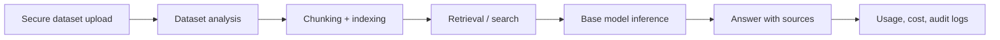
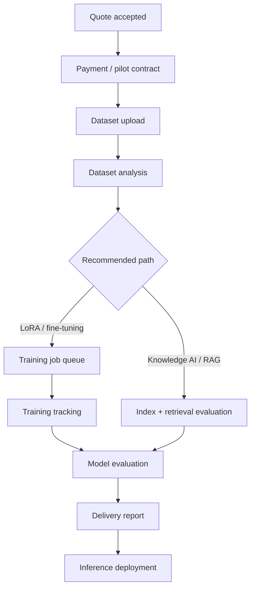

# Vryx Knowledge AI And Fine-Tune Studio

Last updated: 2026-05-23

## Product Principle

Most B2B customers say "we need fine-tuning" when they actually need a secure knowledge system: ingestion, search, citations, access control, no-retention options and a strong base model.

Vryx should therefore sell in this order:

1. **Vryx Knowledge AI**: secure business AI connected to a document base.
2. **Vryx Fine-Tune Studio**: LoRA/fine-tuning/full training only when the dataset and business goal justify training.

## Vryx Knowledge AI

Target customers:

- law firms;
- automotive and industrial teams;
- health or finance teams under compliance constraints;
- enterprise support and internal knowledge bases.

Core workflow:

Expected product modules:

- secure dataset upload;
- document classification and sensitivity score;
- PII/sensitive data warnings;
- cost and duration estimate;
- base model selection;
- private pool/no-retention options;
- searchable index;
- RAG evaluation set;
- deployment endpoint;
- usage and access logs.

## Fine-Tune Studio

Fine-tuning is appropriate when:

- the customer has many high-quality examples;
- the goal is behavior/style/task adaptation, not just knowledge lookup;
- evaluation data exists;
- model license permits training and commercial use;
- retention and dataset permissions are contractually clear.

Methods:

| Method | Use When | Typical Duration |
| --- | --- | --- |
| RAG | Knowledge lookup, citations, frequently changing documents | 2-4 weeks |
| Knowledge AI | Secure business assistant with document base and governance | 2-6 weeks |
| LoRA | Lightweight behavior/domain adaptation | 3-8 weeks |
| Fine-tuning | Strong supervised adaptation with clean examples | 6-12 weeks |
| Full training | Rare strategic project with large proprietary corpus | 12+ weeks |

## Quote Inputs

The Enterprise configurator now captures:

- method: Knowledge AI, RAG, fine-tuning, LoRA or full training;
- dataset size in GB;
- estimated document count;
- sensitive-sector flag;
- privacy mode;
- model choice;
- SLA;
- monthly token volume;
- dedicated worker need.

The API stores these values inside `enterprise_quote_requests.quote_json` together with:

- recommendation;
- recommendation reason;
- estimated duration;
- dataset analysis;
- setup and monthly estimate.

## Job Pipeline Target

## Compliance Rules

For sensitive customers:

- default to Knowledge AI/RAG private processing;
- no external workers unless contract explicitly permits it;
- no-retention mode available;
- dataset deletion evidence required;
- model license reviewed before commercial deployment;
- access logs enabled for dataset and admin actions.

## Engineering Backlog

1. Add authenticated dataset upload endpoint.
2. Store dataset metadata and sensitivity classification.
3. Add dataset deletion job with audit evidence.
4. Add queue tables or BullMQ jobs for analysis/training/evaluation/deployment.
5. Add project dashboard for dataset, job, evaluation and deployment status.
6. Add evaluator for RAG answer quality and fine-tune validation.
7. Add payment milestone: scoping, pilot, production deployment.

