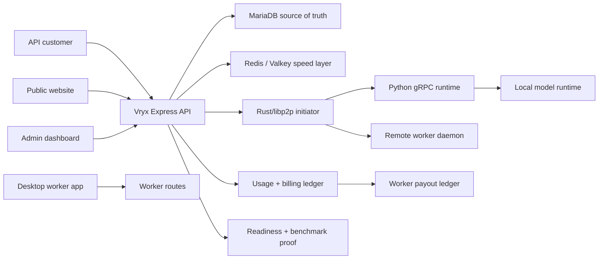
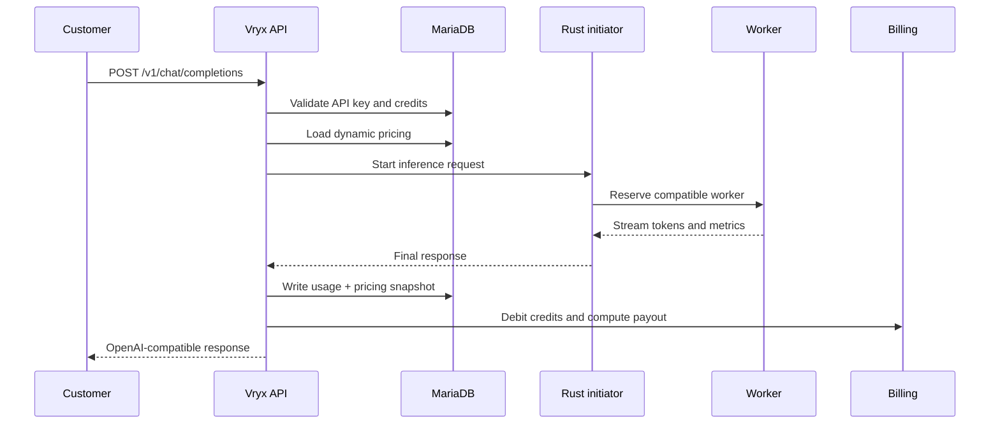

# 01 - Technical Architecture

## One-Line Architecture

Vryx is an AI inference control plane that routes customer API requests to available workers, measures the result, bills the customer, and calculates worker payouts.

## System Map

## Main Components

| Component | Stack | Role |
| --- | --- | --- |
| Public site | React, Vite, TypeScript | Product pages, network proof, pricing and enterprise funnel. |
| API server | Node.js, Express, Zod | Auth, account, API keys, billing, workers, admin and OpenAI-compatible routes. |
| Database | MariaDB | Users, credits, pricing, usage, payout, worker registry and audit logs. |
| Speed layer | Redis/Valkey | Cache, locks, idempotency, live worker state and queues. |
| P2P daemon | Rust, libp2p, Axum | Bootstrap, initiator, workers, peer discovery and network routing. |
| Inference runtime | Python, gRPC, MLX, llama.cpp, vLLM | Model execution, token streaming and benchmarkable latency/TPS. |
| Desktop worker | Electron, React | Contributor app for hardware detection, worker launch, metrics and onboarding. |
| Ops | VPS, Nginx, PM2, systemd | Production web/API, Rust services, worker services and logs. |

## Request Flow

## Source Of Truth

MariaDB is the source of truth for:

- users and admin roles;
- API keys and sessions;
- credits and billing ledger;
- Stripe checkout sessions;
- dynamic pricing and audit trail;
- API usage;
- worker payout ledger;
- enterprise quotes and customer projects.

Redis/Valkey is deliberately not the source of truth for money. It is used for speed, coordination and temporary state.

## Route Boundaries

The server is being progressively split into maintainable boundaries:

- `src/middlewares/auth.js`: session, admin and API key guards;
- `src/middlewares/csrf.js`: browser mutation protection;
- `src/middlewares/rate-limit.js`: abuse limits;
- `src/services/billing.js`: shared token/euro calculations;
- `src/services/security.js`: timing-safe comparisons and hashing helpers;
- `src/routes/`: target location for auth, account, workers, admin and OpenAI-compatible route modules.

The current migration approach is intentionally low-risk: extract cross-cutting security/billing logic first, then move route groups.

## Deployment Model

Production web/API deployment uses:

- static React assets under `/var/www/vryx/dist`;
- API server under `/var/www/vryx/server`;
- PM2 process `vryx-api`;
- health check `GET /api/health`;
- Nginx TLS reverse proxy;
- systemd services for Rust initiator and workers.

## Operational Evidence

The repository includes:

- `website_deploy.py` for web/API deployment;
- `scripts/deploy-vps-runtime.sh` for runtime deployment;
- PM2 and systemd observability exposed in admin;
- CI workflows for frontend, backend, Rust, security and worker release;
- public redacted network status endpoints.

