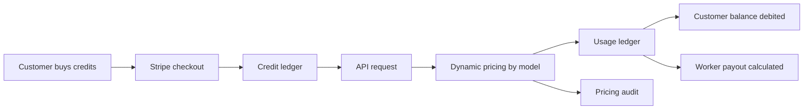

# 02 - Business Model And Pricing

## Core Thesis

Vryx monetizes AI inference capacity. Customers pay for tokens, private capacity or custom projects. Workers contribute compute and receive payouts based on measured usage and pricing snapshots.

## Offers

| Offer | Buyer | What Is Sold | Entry Price |
| --- | --- | --- | --- |
| Vryx API | Developers, startups, internal tools | OpenAI-compatible inference with prepaid credits | Credit packs from 50 EUR |
| Vryx Private Pool | SMEs and enterprise teams | Dedicated or semi-dedicated model capacity with SLA | From 3,500 EUR/month |
| Vryx Knowledge AI / Custom AI | Enterprise teams with domain data | Secure document AI first, then LoRA/fine-tuning when justified | From 6,000 EUR/month plus setup |

## Revenue Loop

For the investor demo, the economic flow is validated in staging mode: admin credits can replace live card payment, while pricing, API keys, credit debit, `api_key_usage` and `worker_payout_ledger` remain real. This is intentionally not a fake demo mode; it is a bank-payment-free staging path.

Investor wording:

> The economic flow is validated in staging through admin credits and ledger writes. Stripe live, real invoicing and signed worker app distribution are the next production steps.

## Pricing System

Pricing is treated as business data, not hard-coded copy:

- public model catalog reads dynamic prices;
- admin pricing can update model economics;
- API billing uses the same pricing source;
- each usage row stores a pricing snapshot;
- pricing changes are audit-logged.

The target is simple: if admin changes a model price, the public model page, simulator, API cost and database usage row should all follow the same value.

## Margin Logic

Vryx should not price as if it owns and amortizes all GPUs. The model is a marketplace/control-plane margin:

- customer price covers software, routing, reliability, support, security and network coordination;
- worker payout compensates contributed compute;
- Vryx margin is the spread after worker payout and platform costs;
- admin UI must flag unprofitable configurations before they are published.

## Billing Tables

| Table | Purpose |
| --- | --- |
| `billing_credit_ledger` | Source of truth for customer balance. |
| `billing_checkout_sessions` | Stripe checkout sessions and payment status. |
| `api_key_usage` | Per-request tokens, cost, pricing snapshot and latency. |
| `worker_payout_ledger` | Pending, approved and paid worker payout rows. |
| `pricing_config_audit` | History of pricing changes. |

## Demo Versus Production Scope

| Topic | Demo / staging status | Production roadmap |
| --- | --- | --- |
| Stripe live | Not required for demo; admin credits and Stripe test can validate the path. | Enable live checkout, webhook secret rotation, invoices and tax settings. |
| Real bank payouts | Not required for demo; payout ledger proves worker economics. | Add payout provider, bank details, tax/KYC checks and payment batches. |
| VAT and legal invoices | Not required for demo. | Finalize tax settings, invoice templates and accounting export. |
| Apple notarization | Optional for demo. | Required before broad macOS worker distribution. |
| Windows signing | Optional for demo. | Required before broad Windows worker distribution. |
| Signed auto-update | Optional for demo. | Required before public worker app rollout. |
| Google OAuth production | Optional if email/password admin works. | Configure production OAuth credentials and redirect URIs. |

The production claim should stay precise: Vryx has a validated staging money path and auditable ledgers today; live payment operations and signed worker distribution are the next production hardening steps.

## Investor Acceptance Criteria

The money path is credible when a test proves:

- a customer has prepaid credits;
- an API key can call a model;
- the request uses dynamic pricing;
- usage cost is non-zero and stored;
- the customer balance decreases;
- worker payout is created only for successful usage;
- the pricing snapshot is present;
- no duplicate ledger rows are created on retry.

Reference: `docs/BILLING_MONEY_PATH.md`.

## Knowledge AI Before Fine-Tuning

For legal, finance, health, industry and defense-adjacent buyers, the default recommendation is Vryx Knowledge AI: secure dataset ingestion, retrieval, citations, no-retention options and private inference. Fine-tuning is positioned as a second-stage product when the customer has clean examples, evaluation data and a clear behavior-adaptation goal.

Reference: `docs/VRYX_KNOWLEDGE_AI_AND_FINE_TUNE_STUDIO.md`.
