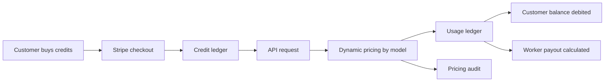

# 02 - Business Model And Pricing

## Core Thesis

Vryx monetizes AI inference capacity. Customers pay for tokens, private capacity or custom projects. Workers contribute compute and receive payouts based on measured usage and pricing snapshots.

## Offers

| Offer | Buyer | What Is Sold | Entry Price |
| --- | --- | --- | --- |
| Vryx API | Developers, startups, internal tools | OpenAI-compatible inference with prepaid credits | Credit packs from 50 EUR |
| Vryx Private Pool | SMEs and enterprise teams | Dedicated or semi-dedicated model capacity with SLA | From 3,500 EUR/month |
| Vryx Custom AI | Enterprise teams with domain data | RAG, fine-tuning, integration and managed inference | From 6,000 EUR/month plus setup |

## Revenue Loop

## Pricing System

Pricing is treated as business data, not hard-coded copy:

- public model catalog reads dynamic prices;
- admin pricing can update model economics;
- API billing uses the same pricing source;
- each usage row stores a pricing snapshot;
- pricing changes are audit-logged.

The target is simple: if admin changes a model price, the public model page, simulator, API cost and database usage row should all follow the same value.

## Margin Logic

Vryx should not price as if it owns and amortizes all GPUs. The model is a marketplace/control-plane margin:

- customer price covers software, routing, reliability, support, security and network coordination;
- worker payout compensates contributed compute;
- Vryx margin is the spread after worker payout and platform costs;
- admin UI must flag unprofitable configurations before they are published.

## Billing Tables

| Table | Purpose |
| --- | --- |
| `billing_credit_ledger` | Source of truth for customer balance. |
| `billing_checkout_sessions` | Stripe checkout sessions and payment status. |
| `api_key_usage` | Per-request tokens, cost, pricing snapshot and latency. |
| `worker_payout_ledger` | Pending, approved and paid worker payout rows. |
| `pricing_config_audit` | History of pricing changes. |

## Investor Acceptance Criteria

The money path is credible when a test proves:

- a customer has prepaid credits;
- an API key can call a model;
- the request uses dynamic pricing;
- usage cost is non-zero and stored;
- the customer balance decreases;
- worker payout is created only for successful usage;
- the pricing snapshot is present;
- no duplicate ledger rows are created on retry.

Reference: `docs/BILLING_MONEY_PATH.md`.

