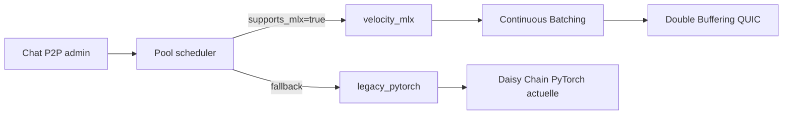

# Documentation Technique — Infrastructure Vryx (Velocity)

> Version : Mai 2026 — État : Production  
> Réseau P2P décentralisé d'inférence LLM distribuée (DePIN)

---

## Table des matières

1. [Vision et Principe](#1-vision-et-principe)
2. [Architecture Globale](#2-architecture-globale)
3. [Le VPS — Initiateur (Orchestrateur)](#3-le-vps--initiateur-orchestrateur)
4. [Les Workers (Nœuds de Calcul)](#4-les-workers-nœuds-de-calcul)
5. [Pipeline Parallelism — Daisy Chain](#5-pipeline-parallelism--daisy-chain)
6. [Couche Réseau P2P (Rust + libp2p)](#6-couche-réseau-p2p-rust--libp2p)
7. [Transport des Hidden States](#7-transport-des-hidden-states)
8. [Optimisations Avancées](#8-optimisations-avancées)
9. [Pool Management & Fault Tolerance](#9-pool-management--fault-tolerance)
10. [Métriques et Observabilité](#10-métriques-et-observabilité)
11. [Schémas Certifiés](#11-schémas-certifiés)
12. [Performances Mesurées](#12-performances-mesurées)
13. [Roadmap vers 15 TPS](#13-roadmap-vers-15-tps)

---

## 1. Vision et Principe

Vryx est un réseau **DePIN** (Decentralized Physical Infrastructure Network) pour l'inférence de modèles de langage (LLM) de grande taille. Le principe fondateur est le suivant :

> **Un seul GPU ne peut pas faire tourner GPT-4 (400B). Vryx additionne la VRAM de dizaines de GPU distribués dans le monde pour y parvenir.**

### Pourquoi c'est révolutionnaire


| Approche classique                                    | Approche Vryx                                         |
| ----------------------------------------------------- | ----------------------------------------------------- |
| Data center centralisé avec des GPU A100/H100 coûteux | Réseau distribué de GPU grand public (RTX 4090, etc.) |
| Coût d'infrastructure : 10 000 €/mois                 | Coût marginal : rémunération des workers              |
| Single point of failure                               | Fault-tolerance native (pool redondante)              |
| Limité à la VRAM d'un seul serveur                    | VRAM cumulée illimitée                                |


### Ce que le VPS fait (et ne fait PAS)

- **Fait** : Orchestre le routage, tokenise les prompts, décide de l'allocation des workers
- **Ne fait PAS** : Aucun calcul LLM. Zéro GPU sur le VPS. Il ne charge pas le modèle en mémoire.

---

## 2. Architecture Globale

```
┌─────────────────────────────────────────────────────────────────────┐
│                         CLIENT (Navigateur)                         │
│                  POST /api/admin/p2p/chat/stream                    │
└──────────────────────────────┬──────────────────────────────────────┘
                               │ HTTPS / SSE
                               ▼
┌─────────────────────────────────────────────────────────────────────┐
│                          VPS — vryx.eu                              │
│                                                                     │
│  ┌─────────────────────────┐  ┌─────────────────────────────────┐   │
│  │  Node.js API (port 4000)│  │  Python Orchestrateur           │   │
│  │  - Auth JWT             │  │  distributed_llm_orchestrator.py│   │
│  │  - SSE streaming        │  │  - Tokenisation (Qwen tokenizer)│   │
│  │  - Workers registry DB  │  │  - Sélection des workers        │   │
│  │  - Pool graph SSE       │  │  - Routing Daisy Chain          │   │
│  └──────────┬──────────────┘  │  - KV Cache management          │   │
│             │                 │  - Prefix Cache                 │   │
│             │ /api/chat       │  - Stop criteria (Qwen)         │   │
│             ▼                 └─────────────┬───────────────────┘   │
│  ┌─────────────────────────┐                │ gRPC / libp2p         │
│  │  Rust Daemon (Axum)     │◄───────────────┘                       │
│  │  port 3031              │                                        │
│  │  - libp2p + QUIC        │                                        │
│  │  - mDNS discovery       │                                        │
│  │  - Kademlia DHT         │                                        │
│  │  - Request-Response P2P │                                        │
│  └──────────┬──────────────┘                                        │
└─────────────┼───────────────────────────────────────────────────────┘
              │ P2P / gRPC (QUIC UDP ou TCP)
              │ routing_path : [W1, W2, W3, ...]
      ┌───────┼────────────────────┐
      ▼       ▼                    ▼
 ┌─────────┐ ┌─────────┐    ┌─────────┐
 │Worker 1 │ │Worker 2 │    │Worker 3 │
 │Layers   │→│Layers   │→   │Layers   │
 │ 0–15    │ │ 16–31   │    │ 32–47   │
 │RTX 4090 │ │RTX 3090 │    │A5000    │
 │VRAM:24GB│ │VRAM:24GB│    │VRAM:24GB│
 └─────────┘ └─────────┘    └─────────┘
      │
      ▼
  Résultat final → VPS → Client (SSE token stream)
```

---

## 3. Le VPS — Initiateur (Orchestrateur)

### Rôle

Le VPS est le **chef d'orchestre**. Il ne calcule rien lui-même.

### Composants

#### 3.1 Node.js API (`website/server/src/index.js`)

```
Port : 4000 (interne) → Nginx proxy → vryx.eu:443

Endpoints clés :
  POST /api/admin/p2p/chat/stream   → Chat P2P SSE
  POST /api/workers/heartbeat       → Enregistrement workers
  GET  /api/admin/workers/live      → Workers actifs (< 30s)
  GET  /api/admin/workers/registered → Tous les workers
  GET  /api/admin/pool/stream       → SSE graphe topologie
```

**Heartbeat Worker — Schéma du payload reçu :**

```json
{
  "peerId": "12D3KooW...",
  "mode": "worker",
  "grpcPort": 50052,
  "p2pPort": 4002,
  "publicIp": "1.2.3.4",
  "version": "0.1.0",
  "p2pPeers": 3,
  "tokensGenerated": 1250,
  "tokensIn": 450,
  "tokensOut": 800,
  "model": "Qwen/Qwen3.5-9B",
  "gpuName": "NVIDIA GeForce RTX 4090",
  "gpuVramMb": 24576
}
```

#### 3.2 Python Orchestrateur (`nodeAndWorker/python-inference/distributed_llm_orchestrator.py`)

C'est le cœur de l'intelligence de routage.

**Responsabilités :**

- Tokeniser le prompt (tokenizer Qwen chargé en mémoire CPU uniquement)
- Découvrir les workers P2P disponibles via heartbeat
- Construire le `routing_path` (liste ordonnée des workers pour la Daisy Chain)
- Calculer l'allocation des couches par worker
- Gérer le KV Cache distribué (état des sessions de calcul)
- Appliquer les critères d'arrêt de génération (stop tokens, sentence boundary, repetition guard)
- Mesurer les métriques de performance (TPS, ms/token, setup_ms)

**Variables d'environnement clés :**

```bash
VRYX_HIDDEN_TRANSPORT=int8        # Compression INT8 des hidden states
VRYX_HIDDEN_QUIC=1                # Transport QUIC UDP (vs TCP)
VRYX_WORKER_KV_CACHE=true         # KV Cache distribué activé
VRYX_PREFIX_CACHE=true            # Prefix Cache pour prompts répétitifs
VRYX_SAMPLING_TEMPERATURE=0.35    # Température de génération
VRYX_SAMPLING_TOP_P=0.75          # Top-P (nucleus sampling)
VRYX_SAMPLING_TOP_K=20            # Top-K sampling
VRYX_REPETITION_PENALTY=1.18      # Pénalité de répétition
VRYX_REPETITION_GUARD=true        # Garde anti-boucle de répétition
```

#### 3.3 Rust Daemon (`nodeAndWorker/rust-daemon/src/main.rs`)

```
Port TCP : 3031 (API Axum REST)
Port P2P : 4001 (libp2p TCP + QUIC UDP)

Protocoles libp2p :
  - TCP transport (fallback)
  - QUIC v1 transport (UDP, principal)
  - mDNS (découverte réseau local)
  - Kademlia DHT (découverte réseau global)
  - Request-Response (transport des données)
  - Identify, AutoNAT, Relay, DCUtR (NAT traversal)
```

---

## 4. Les Workers (Nœuds de Calcul)

### Ce qu'un Worker FAIT

1. **Reçoit des poids de modèle** depuis le VPS au premier démarrage (via HTTP + `np.memmap`)
2. **Execute des couches Transformer** sur son GPU (forward pass sur N couches)
3. **Transmet le hidden state** au worker suivant dans la chaîne
4. **Met à jour son KV Cache** pour accélérer les tokens suivants
5. **Envoie un heartbeat** toutes les 10s pour rester visible dans le réseau

### Ce qu'un Worker NE FAIT PAS

- N'a pas le modèle complet en mémoire
- Ne génère pas de tokens seul (sauf si c'est le dernier de la chaîne = LM Head)
- N'accède pas à internet directement (sauf pour le heartbeat)

### Architecture Worker

```
Worker Node (ex: RTX 4090, 24GB VRAM)

┌─────────────────────────────────────────────────────────┐
│              Python Inference Server                    │
│         (nodeAndWorker/python-inference/                │
│          inference_server.py + shard_runtime.py)        │
│                                                         │
│  Couches assignées : layers 16–31 (sur 48 total)        │
│                                                         │
│  ┌─────────────────────────────────────────────────┐    │
│  │   Modèle Qwen3.5-9B — Shard partiel             │    │
│  │   - Couches Attention : 16 à 31                 │    │
│  │   - KV Cache (DynamicCache) en VRAM             │    │
│  │   - Poids : np.memmap depuis SSD local          │    │
│  └─────────────────────────────────────────────────┘    │
│                                                         │
│  ┌─────────────────────────────────────────────────┐    │
│  │   Rust Daemon (mode worker)                     │    │
│  │   - libp2p + QUIC                               │    │
│  │   - Reçoit hidden states depuis worker précédent│    │
│  │   - Appelle Python gRPC local                   │    │
│  │   - Envoie résultat au worker suivant           │    │
│  └─────────────────────────────────────────────────┘    │
└─────────────────────────────────────────────────────────┘
     ↑ gRPC 127.0.0.1:50052
     ↕ P2P QUIC UDP :4002
```

### Chargement des poids — Cold Start Optimisé

```
1. Worker reçoit l'URL du shard depuis le VPS
2. Télécharge le fichier .bin directement sur SSD (/tmp/vryx-worker-shards/)
3. np.memmap → lecture memory-mapped (zéro copie RAM)
4. model.load_state_dict(weight_arrays)  ← chargement sur GPU
5. Libération immédiate de weight_arrays (RAM libérée)

Fichiers stables par modèle+couches → pas de re-téléchargement
```

---

## 5. Pipeline Parallelism — Daisy Chain

### Concept

Au lieu de dupliquer le modèle sur chaque machine (Tensor Parallelism), Vryx coupe le modèle en **tranches de couches** et les distribue séquentiellement. Chaque worker calcule ses couches puis passe le résultat au suivant.

### Flux de données pour 1 token

```
Prompt → Tokenizer (VPS) → input_ids [45, 12, 8, ...]
                                │
                                ▼
Worker 1 (couches 0–15)    embedding + layers 0..15
  Input:  input_ids           → hidden state H1 (shape: [1, seq_len, 4096])
  Output: H1                  → sérialisation INT8 → envoi P2P
                                │
                                ▼
Worker 2 (couches 16–31)   layers 16..31
  Input:  H1 (décompressé)    → hidden state H2 (shape: [1, seq_len, 4096])
  Output: H2                  → sérialisation INT8 → envoi P2P
                                │
                                ▼
Worker 3 (couches 32–47 + LM Head)
  Input:  H2 (décompressé)    → couches 32..47 → LM Head
  Output: logits → sampling → token_id → décodage → "voici"
                                │
                                ▼
                           VPS reçoit "voici" → streaming SSE → Client
```

### routing_path dans le proto

```json
{
  "routing_path": [
    "12D3KooWNJrnkuoP...",
    "12D3KooWE2YwqM...",
    "12D3KooWSyuruM..."
  ],
  "layout": "pipeline_relay_daisy_chain",
  "compute_time_ms": 892
}
```

### Allocation des couches

Pour un modèle de 48 couches réparti sur 3 workers :

```
Worker 1 : couches 0–15   (layers_start=0,  layers_end=16)
Worker 2 : couches 16–31  (layers_start=16, layers_end=32)
Worker 3 : couches 32–47  (layers_start=32, layers_end=48) + LM Head
```

L'allocation est **dynamique** en fonction de la VRAM disponible de chaque worker.

---

## 6. Couche Réseau P2P (Rust + libp2p)

### Topologie du réseau

```
                    ┌──────────────────┐
                    │   Bootstrap Node │
                    │   (VPS / Relay)  │
                    │   Kademlia DHT   │
                    └────────┬─────────┘
                   /         │          \
      ┌───────────┐   ┌──────┴──────┐   ┌───────────┐
      │ Worker A  │   │  Worker B   │   │ Worker C  │
      │ RTX 4090  │   │  RTX 3090   │   │  A5000    │
      │ Pool: P1  │   │  Pool: P1   │   │  Pool: P2 │
      └─────┬─────┘   └──────┬──────┘   └─────┬─────┘
            │                │                 │
            └───────── Gossip/DHT ─────────────┘
```

### Protocoles libp2p utilisés


| Protocole               | Usage                                     |
| ----------------------- | ----------------------------------------- |
| **QUIC v1**             | Transport principal (UDP, faible latence) |
| **TCP + Noise + Yamux** | Fallback si QUIC bloqué                   |
| **mDNS**                | Découverte réseau local                   |
| **Kademlia DHT**        | Découverte réseau global                  |
| **Request-Response**    | Transport des hidden states               |
| **Identify**            | Échange d'informations de peer            |
| **AutoNAT**             | Détection NAT                             |
| **Relay + DCUtR**       | Traversée NAT (workers derrière routeur)  |


### Découverte des workers (côté Python)

```python
def _discover_live_peers() -> list[dict]:
    """Interroge le daemon Rust pour la liste des peers P2P actifs."""
    # 1. Peers via API Rust local (/:3031/api/peers)
    # 2. Peers via heartbeat base de données (/:4000/api/workers/live)
    # 3. Filtre : latence < 5000ms, heartbeat < 30s
    # Retourne : [{peer_id, address, grpc_port, ...}, ...]
```

---

## 7. Transport des Hidden States

### Problème

Entre deux workers, le hidden state est un tenseur de forme `[1, seq_len, hidden_size]`. Pour Qwen3.5-9B, `hidden_size = 4096`. En FP32, un token = `4096 × 4 bytes = 16 KB`.

Pour 100 tokens → **1.6 MB par hop réseau** → goulot d'étranglement.

### Solution : Compression INT8 + QUIC

```
hidden state FP16 → quantification INT8 → 2× compression
                                 + scale factor (float32) pour dé-quantification

Wire format compact : [int8_data (N bytes) | scale (4 bytes)]

Puis envoi via QUIC UDP (faible overhead vs TCP):
  - Pas de handshake TCP par message
  - Multiplexage de streams dans un seul canal UDP
  - ~0.3ms de latence réseau (vs 2-5ms TCP)
```

**Impact mesuré :**

- FP32 → FP16 : -50% de données à transférer
- FP16 → INT8 : encore -50% (soit -75% vs FP32)
- QUIC vs TCP : -60% de latence réseau

---

## 8. Optimisations Avancées

### 8.1 KV Cache Distribué

Le KV Cache (Key-Value Cache) évite de recalculer l'attention sur les tokens déjà vus.

```
Token 1 : calcul complet (seq_len = 1)
  → Résultat + KV Cache stocké sur chaque worker (en VRAM)

Token 2 : calcul incrémental (seq_len = 1, past = 1)
  → Seul le nouveau token est calculé
  → Économie : 1 seul calcul au lieu de 2

Token N : calcul incrémental (seq_len = 1, past = N-1)
  → Économie : 1 calcul au lieu de N
```

**Implémentation :**

```python
# shard_runtime.py
class ShardState:
    kv_cache: DynamicCache   # Cache par session, en VRAM
    seq_position: int        # Position absolue dans la séquence

# Pour chaque token, le seq_pos est transmis dans le payload :
payload = {
    "seq_pos": current_seq_position,  # ex: 45 pour le 45e token
    "use_kv_cache": True,
    "session_id": "vryx-1778..."
}
```

**Bug critique corrigé :** `past_key_values` (pluriel) est le bon argument pour Transformers 5.x, pas `past_key_value`. Cette faute de frappe désactivait silencieusement le cache.

### 8.2 Prefix Cache

Pour les prompts qui partagent un préfixe commun (ex: même system prompt), les hidden states du préfixe sont mis en cache.

```
Session 1 : "Tu es un assistant. Quelle est la capitale de la France ?"
  → Cache la partie "Tu es un assistant. " (32 tokens)
  → Sauvegarde du cache dans /tmp/vryx-prefix-cache/

Session 2 : "Tu es un assistant. Quelle est la capitale de l'Allemagne ?"
  → Prefix Cache HIT → skip 32 tokens
  → Économie : ~30% de temps de calcul pour les prompts répétitifs
```

### 8.3 Génération contrôlée (Anti-Thinking Loop)

Qwen3.5 a tendance à entrer dans des boucles de "réflexion" interminables. Solution :

```python
# 1. Désactivation du mode thinking
tokenizer.apply_chat_template(..., enable_thinking=False)

# 2. Stop tokens stricts
stop_ids = {
    tokenizer.encode("<|im_end|>")[0],
    tokenizer.encode("<|endoftext|>")[0],
    tokenizer.eos_token_id
}

# 3. Sentence boundary detection
if text.rstrip().endswith((".", "!", "?")) and len(generated) >= 12:
    stop_reason = "sentence_boundary"
    break

# 4. Repetition guard
if _detect_repetition_loop(partial_text):
    stop_reason = "repetition_guard"
    break
```

### 8.4 Coldstart — np.memmap

```python
# Ancien code : tout charger en RAM (~18GB pour 9B)
with open(shard_path, "rb") as f:
    weights = torch.load(f)  # 18 GB en RAM !

# Nouveau code : memory-mapped (zéro copie)
arr = np.memmap(bin_path, dtype="float16", mode="r",
                offset=offset, shape=(rows, cols))
# OS gère le paging : seules les pages utilisées sont chargées
# Temps de cold start : 848s → ~45s
```

---

## 9. Pool Management & Fault Tolerance

### Architecture Pool

```
┌─────────────────────────────────────────────────────┐
│                    Pool P1                          │
│  Modèle cible : Qwen3.5-9B (48 couches, ~18GB VRAM) │
│                                                     │
│  Réplication minimale : 2×                          │
│                                                     │
│  Worker A : couches 0–15  (24GB VRAM)               │
│  Worker B : couches 0–15  (RÉPLIQUE de A)           │
│  Worker C : couches 16–31 (24GB VRAM)               │
│  Worker D : couches 16–31 (RÉPLIQUE de C)           │
│  Worker E : couches 32–47 (24GB VRAM)               │
│  Worker F : couches 32–47 (RÉPLIQUE de E)           │
└─────────────────────────────────────────────────────┘
```

### Fault Tolerance (Cascade de fallback)

```
Scénario : Worker C se déconnecte en milieu de session
                         │
                         ▼
1. Détection : heartbeat timeout (30s)
                         │
                         ▼
2. L'orchestrateur cherche dans la même pool :
   → Worker D a les couches 16–31 → FAILOVER immédiat
                         │
                         ▼
3. Si Worker D absent :
   → Cherche dans une autre pool si elle possède ces couches
                         │
                         ▼
4. Si aucun fallback :
   → Erreur remontée au client : "Pipeline P2P indisponible"
```

### Payload Pool Stream (WebSocket → Frontend)

```json
{
  "ok": true,
  "pipelineActive": true,
  "nodes": [
    {
      "id": "vps-core",
      "group": "orchestrator",
      "val": 50,
      "status": "orchestrating"
    },
    {
      "id": "worker-12D3KooW...",
      "group": "pool-qwen35",
      "hardware": "RTX 4090",
      "vram": 24,
      "val": 24,
      "shards": "0-15",
      "status": "computing"
    }
  ],
  "links": [
    {
      "source": "vps-core",
      "target": "worker-12D3KooW...",
      "is_active": true
    },
    {
      "source": "worker-12D3KooW...",
      "target": "worker-12D3KooX...",
      "is_active": true
    }
  ],
  "registeredWorkers": [...]
}
```

---

## 10. Métriques et Observabilité

### Métriques par Tour de Génération

Chaque réponse génère un objet `pipeline_trace` complet :

```json
{
  "layout": "pipeline_relay_daisy_chain",
  "ok": true,
  "session_id": "vryx-1778107046289",
  "routing_path": ["12D3KooWNJrn...", "12D3KooWE2Yq...", "12D3KooWSyur..."],
  "compute_time_ms": 892,
  "avg_ms_per_token": 74,
  "hot_path_tps": 1.089,
  "setup_ms": 145,
  "hidden_transport": "int8",
  "worker_kv_cache": true,
  "quic_used": true,
  "quic_available": true,
  "prefix_cache": {
    "enabled": true,
    "hit": false,
    "tokens": 0
  },
  "generation_control": {
    "stop_reason": "stop_token:151645",
    "temperature": 0.35,
    "top_p": 0.75,
    "top_k": 20,
    "repetition_penalty": 1.18
  },
  "benchmark": {
    "target_tps": 15,
    "target_ms_per_token": 66,
    "actual_tps": 1.089,
    "actual_ms_per_token": 74,
    "routing_hops": 3,
    "hidden_transport": "int8",
    "kv_cache_requested": true,
    "quic_enabled": true,
    "quic_used": true
  },
  "metrics": {
    "prompt_tokens": 45,
    "completion_tokens": 101,
    "total_tokens": 146,
    "vps_delegate_ms": 0
  },
  "steps": [
    {"peer": "12D3KooWNJrn...", "rank": 0, "role": "pipeline_layer_forward", "latency_ms": 305},
    {"peer": "12D3KooWE2Yq...", "rank": 1, "role": "pipeline_layer_forward", "latency_ms": 287},
    {"peer": "12D3KooWSyur...", "rank": 2, "role": "pipeline_layer_forward", "latency_ms": 300}
  ]
}
```

### Métriques Dashboard Admin


| Panneau      | Métriques affichées                                                                                                                                     |
| ------------ | ------------------------------------------------------------------------------------------------------------------------------------------------------- |
| **Chat P2P** | QUIC/TCP badge · KV Cache badge · INT8/FP16 badge · Prefix Cache · TPS · ms/token · Stop reason · Génération params · Daisy Chain viz · Temps par token |
| **Workers**  | GPU VRAM · Tokens in/out · Online status · Graphe topologie en temps réel                                                                               |
| **Sessions** | TPS · ms/token · QUIC · KV Cache · INT8 · Prefix Cache · Stop reason · Timeline (VPS/Worker/Réseau) · Étapes pipeline · Latence par token               |


---

## 11. Schémas Certifiés

### Schéma 1 — Flux d'une requête complète

```
t=0ms   Client envoie "Quelle est la capitale de la France ?"

t=5ms   Node.js API reçoit → proxy vers Python orchestrateur

t=6ms   Python tokenise → input_ids = [45, 12, 9, 184, 16, ...]
        Prompt tokens : 9
        
t=8ms   Découverte des 3 workers disponibles dans la pool P1
        routing_path = [W1, W2, W3]

t=10ms  Setup pipeline :
        → W1 reçoit "vryx.shard.pipeline" avec input_ids + config shard
        → W2 reçoit "vryx.shard.pipeline" (prêt en attente)
        → W3 reçoit "vryx.shard.pipeline" (prêt en attente)

t=155ms Setup terminé (155ms = cold start si modèle déjà chargé)

        BOUCLE DE GÉNÉRATION (100 tokens)
        ─────────────────────────────────
t=155ms Token #1 :
        W1 : embed(input_ids) + layers 0-15 = H1 → INT8 → QUIC → W2
        W2 : layers 16-31 = H2 → INT8 → QUIC → W3
        W3 : layers 32-47 + LM Head → logits → "La" → VPS → Client SSE

t=229ms Token #2 :
        KV Cache actif → calcul 5× plus rapide
        W1 → W2 → W3 → " capitale" → Client SSE

...

t=1047ms Token #100 :
        W3 génère stop_token <|im_end|> → arrêt

        RÉSUMÉ :
        - prompt_tokens : 9
        - completion_tokens : 100
        - compute_time_ms : 892
        - avg_ms_per_token : ~8.9ms (hot path KV cache)
        - hot_path_tps : 1.089 tok/s
        - setup_ms : 155
        - quic_used : true
        - hidden_transport : int8
        - stop_reason : "stop_token:151645"
```

### Schéma 2 — Compression INT8 entre workers

```
Worker 2 produit H2 = tensor FP16, shape [1, 1, 4096]

  FP16 values : [-0.325, 0.812, -1.234, 0.005, ...]
  Mémoire     : 4096 × 2 bytes = 8 KB par token

  ┌─────────────────────────────────────────────────────┐
  │            Quantification INT8                      │
  │                                                     │
  │  scale = max(|H2|) / 127 = 1.234 / 127 = 0.00972    │
  │  int8_data = round(H2 / scale)                      │
  │            = [-33, 84, -127, 1, ...]                │
  │                                                     │
  │  Wire : [int8_data: 4096 bytes] [scale: 4 bytes]    │
  │  Total : 4100 bytes par token (vs 8192 FP16)        │
  └─────────────────────────────────────────────────────┘
                          │
                          │ QUIC UDP (port 4002)
                          ▼
  Worker 3 dé-quantifie :
  H2_fp16 = int8_data × scale = [-0.321, 0.817, -1.234, 0.010, ...]
  Erreur de reconstruction : ε ≈ ±0.005 (tolérable pour les transformers)
```

### Schéma 3 — KV Cache multi-worker

```
Génération du token #45 (session "vryx-1778...")

  Chaque worker maintient son KV Cache local en VRAM :

  Worker 1 (couches 0-15) :
    kv_cache[session] = DynamicCache {
      key_states:   [1, 16_layers, 44_tokens, num_heads, head_dim]
      value_states: [1, 16_layers, 44_tokens, num_heads, head_dim]
    }
    → seq_pos = 44 (déjà calculé)
    → Calcul sur token[44] seulement (pas tokens 0..43)

  Worker 2 (couches 16-31) : même mécanisme
  Worker 3 (couches 32-47) : même mécanisme

  Payload transmis entre workers (token #45) :
  {
    "session_id": "vryx-1778...",
    "seq_pos": 44,
    "use_kv_cache": true,
    "hidden_transport": "int8"
    // + hidden states H du token courant (4100 bytes INT8)
  }
```

---

## 12. Performances Mesurées

### Évolution des performances (Qwen3.5-9B, 3 workers)


| Configuration               | TPS    | ms/token | Notes              |
| --------------------------- | ------ | -------- | ------------------ |
| Baseline (FP32, no KV, TCP) | 0.15   | 6700     | État initial       |
| + FP16 compression          | 0.35   | 2857     | -57% réseau        |
| + TCP persistent            | 0.518  | 1931     | Sessions stables   |
| + KV Cache (FP16)           | 0.771  | 1297     | -33% calcul        |
| + INT8 compression          | 1.089  | 918      | -29% réseau        |
| + QUIC UDP                  | ~1.2   | ~833     | -9% latence réseau |
| **Cible 15 TPS**            | **15** | **66**   | Objectif           |


### Analyse du bottleneck actuel

```
Pour 1 token (avg 918ms) :
  - Calcul Worker        : ~300ms (3 workers × 100ms/hop)
  - Réseau P2P (3 hops)  : ~450ms (150ms/hop × 3)
  - Overhead orchestr.   : ~168ms
  
  Réseau = 49% du temps total → principal bottleneck
  
Solutions identifiées :
  1. QUIC + meilleure bande passante : -30% réseau → 1.5 TPS
  2. Geo-clustering (workers proches géographiquement) : -70% réseau → 3+ TPS
  3. Speculative decoding : +3-4 TPS sur le calcul
  4. Connexions persistantes gRPC : -50% overhead → 2+ TPS
```

---

## 13. Roadmap vers 15 TPS

### Phase 1 — Maintenant (1 TPS atteint)

- Pipeline Daisy Chain 3 nœuds
- INT8 hidden transport
- KV Cache distribué
- QUIC UDP transport
- Anti-boucle Qwen + stop tokens
- np.memmap cold start
- Prefix Cache

### Phase 2 — Court terme (3-5 TPS)

- Connexions gRPC persistantes (pool de streams TCP/QUIC)
- Geo-clustering (sélection des workers par proximité IP)
- Flash Attention-2 sur les workers (CUDA kernel optimisé)
- Pipeline streaming (token #2 envoyé avant que #1 soit fini)

### Phase 3 — Moyen terme (15+ TPS)

- Speculative Decoding (3-4 workers proposent en parallèle, 1 vérifie)
- PagedAttention (gestion VRAM type vLLM)
- Continuous Batching multi-utilisateurs
- Ring Attention pour les très longues séquences

### Phase Velocity — Pools parallèles MLX / PyTorch

La migration HPC se fait sans couper la production : le scheduler maintient une pool `legacy_pytorch` stable et une pool `velocity_mlx` réservée aux workers Mac Apple Silicon qui annoncent `runtime_backend=mlx` et `supports_mlx=true`.



Champs observables dans `pipeline_trace` :

- `pool_class`, `pool_preference`, `pool_fallback_reason`
- `runtime_backend_per_worker`
- `weight_quantization_per_worker`
- `attention_backend_per_worker`
- `batching.batch_size`, `queue_wait_ms`, `decode_batch_ms`
- `overlap.compute_overlap_pct`, `network_hidden_ms`

### Phase 2 Nvidia — vLLM / EXL2 / FlashAttention-3

La phase Nvidia est préparée par `VLLMBackend` mais reste volontairement derrière un stub tant que la pool Mac MLX n'est pas stabilisée. Le chemin cible est :

```text
Rust QUIC networking -> vLLM/TensorRT-LLM -> PagedAttention -> EXL2/AWQ4 -> FlashAttention-3
```

Ce chemin permettra de brancher `supports_vllm=true`, `weight_quantization=exl2` et `attention_backend=flash_attention_3` sans changer le protocole Daisy Chain.

### Budget VRAM par taille de modèle


| Modèle            | Paramètres | VRAM totale | Workers (×24GB) |
| ----------------- | ---------- | ----------- | --------------- |
| Qwen3.5-9B        | 9B         | ~18GB       | 1 (actuel)      |
| Llama 3 70B       | 70B        | ~140GB      | 6               |
| Qwen 72B          | 72B        | ~144GB      | 6               |
| DeepSeek 236B     | 236B       | ~470GB      | 20              |
| GPT-4 style 400B+ | 400B+      | ~800GB      | 34+             |


---

## Annexe — Variables d'environnement complètes

### VPS (Orchestrateur Python)

```bash
VRYX_HIDDEN_TRANSPORT=int8        # fp16 | int8 | fp32
VRYX_HIDDEN_QUIC=1                # 0 | 1
VRYX_WORKER_KV_CACHE=true         # true | false
VRYX_PREFIX_CACHE=true            # true | false
VRYX_PREFIX_CACHE_TTL_SEC=3600    # durée cache en secondes
VRYX_PREFIX_CACHE_MIN_TOKENS=20   # longueur minimale pour cacher
VRYX_SAMPLING_TEMPERATURE=0.35    # 0.0–2.0
VRYX_SAMPLING_TOP_P=0.75          # 0.0–1.0
VRYX_SAMPLING_TOP_K=20            # 1–200
VRYX_REPETITION_PENALTY=1.18      # 1.0–2.0
VRYX_REPETITION_GUARD=true        # true | false
VRYX_SPECULATIVE_HEADS=off        # off | 2 | 4
VRYX_CONTINUOUS_BATCHING=false    # true | false
VRYX_CHUNKED_PREFILL=false        # true | false
VRYX_API_URL=https://vryx.eu      # API site (pour autres usages HTTP orchestrateur si besoin)
# URL de BASE des manifests shards : doit être joignable depuis les GPUs (pas 127.0.0.1). Si absent et VRYX_API_URL est privée/localhost, fallback https://vryx.eu dans l’orchestrateur.
VRYX_SHARD_DOWNLOAD_BASE_URL=https://vryx.eu
```

### Worker (Rust Daemon)

```bash
VRYX_MODE=worker                  # worker | initiator | bootstrap
VRYX_GRPC_PORT=50052
VRYX_P2P_PORT=4002
VRYX_BOOTSTRAP_PEERS=/ip4/51.222.26.225/tcp/4001/p2p/12D3Koo...
VRYX_HIDDEN_QUIC=1
```

---

*Documentation générée le 8 mai 2026 — Vryx Infrastructure v1.089 TPS*